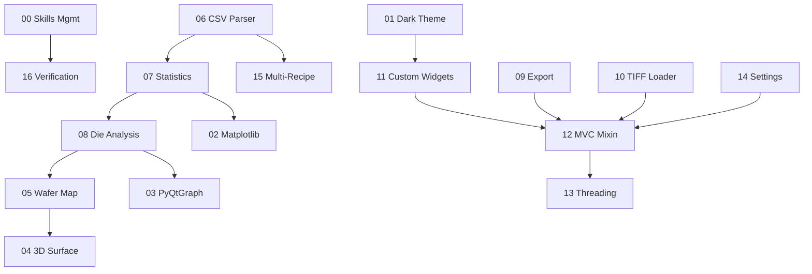

# SKILL 00 — Skills Management & Registry

## Overview

This skill defines the standard process for managing the skills catalog. It covers adding new skills, tracking dependencies, versioning, and discovering skills by tag or source file.

**When to use:** Whenever creating, modifying, or searching for a skill document.

## Directory Structure

```
_agent/skills/
├── skills-en/           ← Primary (English)
│   ├── 00-skills-management/SKILL.md
│   ├── 01-pyside6-dark-theme/SKILL.md
│   └── ...
├── skills-ko/           ← Reference (Korean)
│   ├── 00-스킬-관리/SKILL.md
│   └── ...
└── registry.json        ← Master index
```

## Registry Schema (`registry.json`)

```json
{
  "version": "1.0",
  "updated": "2026-03-10",
  "skills": [
    {
      "id": "00",
      "folder_en": "00-skills-management",
      "folder_ko": "00-스킬-관리",
      "name": "Skills Management & Registry",
      "description": "Manage, discover, and maintain the skills catalog.",
      "version": "1.0",
      "tags": ["meta", "management", "registry"],
      "dependencies": ["16-verification-qa"],
      "source_files": []
    }
  ]
}
```

| Field | Type | Description |
|-------|------|-------------|
| `id` | string | Two-digit ID (`"00"`, `"01"`, …) |
| `folder_en` | string | Directory name under `skills-en/` |
| `folder_ko` | string | Directory name under `skills-ko/` |
| `name` | string | Human-readable skill name |
| `version` | string | Semantic version (`major.minor`) |
| `tags` | string[] | Searchable keywords |
| `dependencies` | string[] | Required skill folder names |
| `source_files` | string[] | Relative paths from `src/` |

## Adding a New Skill

### Step 1 — Assign an ID
Use the next sequential two-digit number. IDs are **never reused**.

### Step 2 — Create SKILL.md

Template:
```yaml
---
name: [Skill Name]
description: [One-line description]
version: 1.0
project_origin: [Project Name]
related_skills: [list of related skill folder names]
---
```

Required sections: Overview, Tech Stack, Architecture, Core Patterns, Code Examples, Pitfalls & Gotchas, Testing Checklist, Related Files.

### Step 3 — Update Registry
Add the new entry to `registry.json`.

### Step 4 — Verify
Run SKILL 16 verification checklist.

## Dependency Graph



## Version Bump Rules

| Change Type | Bump | Example |
|-------------|:----:|---------|
| Typo fix, formatting | None | — |
| New code example | Minor | 1.0 → 1.1 |
| New pattern/API | Major | 1.2 → 2.0 |
| Skill split/merged | Major | New ID |

## Pitfalls & Gotchas

- **Never delete a skill ID.** Mark deprecated with `"deprecated": true`.
- **Korean versions are summaries**, not literal translations.
- **Keep `registry.json` in sync** — always update when modifying skills.

## Testing Checklist

- [ ] `registry.json` valid JSON
- [ ] All `folder_en` entries match existing directories
- [ ] All `source_files` point to existing paths
- [ ] Skill count matches directory count
- [ ] No duplicate IDs
