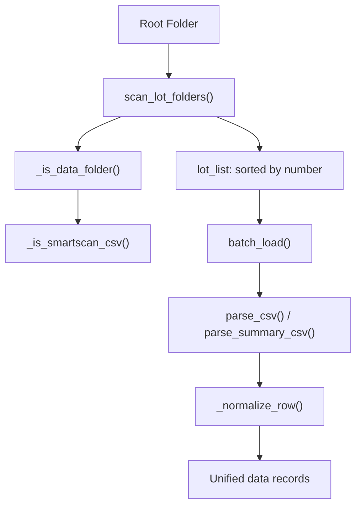

# SKILL 06 — CSV Raw Data Parsing Engine

## Overview

Parses SmartScan recipe result CSV files from semiconductor XY stage positioning measurements. Handles Korean-encoded network drive files, corporate DLP restrictions, automatic folder detection, and flexible batch loading with range specification.

**When to use:** When building a data ingestion pipeline for CSV files that may have metadata headers, multi-encoding issues, or network drive access restrictions.

## Tech Stack

| Library | Purpose |
|---------|---------|
| `csv` (stdlib) | CSV parsing |
| `os`, `re` (stdlib) | File/folder operations, pattern matching |
| `subprocess` (stdlib) | DLP bypass via `xcopy` |
| `typing` | Type hints (`Optional`, `Union`) |

## Architecture



## Core Patterns

### 1. Multi-Encoding Fallback Chain

The parser attempts multiple encodings in order, handling Korean network drive files:

```python
# Source: core/csv_loader.py
_ENCODINGS = ('utf-8-sig', 'cp949', 'euc-kr', 'latin-1')

def _open_csv_rows(csv_path: str):
    for enc in _ENCODINGS:
        try:
            with open(csv_path, 'r', encoding=enc) as f:
                return list(csv.reader(f))
        except (UnicodeDecodeError, UnicodeError):
            continue
    return []
```

**Rationale:** Korean Windows systems commonly use `cp949` encoding. `utf-8-sig` is tried first for BOM-prefixed files. `latin-1` is the last resort as it never fails.

### 2. DLP Bypass via xcopy

Corporate Data Loss Prevention may block Python's `open()` on network drives:

```python
# Source: core/csv_loader.py
def _read_file_bytes(file_path: str):
    try:
        with open(file_path, 'rb') as f:
            return f.read()
    except PermissionError:
        # Fallback: copy file to temp via xcopy (bypasses DLP)
        import tempfile, subprocess
        tmp = tempfile.mktemp(suffix='.csv')
        subprocess.run(['xcopy', file_path, tmp, '/Y'], 
                       capture_output=True, shell=True)
        with open(tmp, 'rb') as f:
            data = f.read()
        os.remove(tmp)
        return data
```

### 3. Meta-Header / Data Separation

SmartScan CSVs have a structured layout:
- Rows 1–9: Key-value metadata (Lot ID, Recipe ID, etc.)
- Rows 10–11: Empty separator
- Row 12: Column headers
- Row 13+: Data rows

```python
# Source: core/csv_loader.py → parse_csv()
meta = {}
for row in rows[:10]:
    if len(row) >= 2 and row[0].strip():
        meta[row[0].strip()] = row[1].strip()

# Find data header row (first row with 'Site ID' column)
header_idx = next(i for i, r in enumerate(rows) if 'Site ID' in r)
header = rows[header_idx]
data = [dict(zip(header, r)) for r in rows[header_idx + 1:] if len(r) >= len(header)]
```

### 4. Structure-Based Folder Detection

Folders are identified by **internal CSV structure**, not folder naming convention:

```python
# Source: core/csv_loader.py → _is_data_folder()
def _is_data_folder(folder_path: str):
    for f in os.listdir(folder_path):
        if f.endswith('.csv') and _is_smartscan_csv(os.path.join(folder_path, f)):
            return {'has_csv': True, ...}
    return None
```

### 5. Flexible Batch Loading

```python
# Source: core/csv_loader.py → batch_load()
batch_load(root_path,
    lot_range=None,          # None = all lots
    # lot_range=(1, 5),      # Lots 1-5 by number
    # lot_range=[0, 2, 4],   # Specific indices
    axis='both',             # 'X', 'Y', or 'both'
    metric_col='HZ1_O (nm)') # Measurement column name
```

### 6. Row Normalization

Every row is converted to a standardized dict:

```python
# Source: core/csv_loader.py → _normalize_row()
{
    'lot_name': 'Lot401',
    'lot_index': 1,
    'filename': 'Lot4_X_UL.csv',
    'site_id': '0001_X000_Y000',
    'site_x': 0, 'site_y': 0,
    'point_no': 1,
    'x_um': 0.0, 'y_um': 0.0,
    'method': 'X',
    'state': 'Completed',
    'valid': True,
    'value': 2976.074,
    'value_valid': True,
}
```

## Pitfalls & Gotchas

- **BOM handling:** Always use `utf-8-sig` first, not `utf-8`, to handle BOM bytes.
- **Network drives:** `open()` may fail silently or raise `PermissionError` due to DLP. The xcopy fallback is Windows-only.
- **Empty rows:** SmartScan CSVs have variable empty row counts between meta and data sections. Use column-header detection, not fixed row numbers.
- **Lot number extraction:** `_extract_folder_number()` handles `Lot401`, `Run_03`, `Test` — always returns an integer for sorting.

## Testing Checklist

- [ ] `parse_csv()` returns `meta`, `header`, and `data` for a valid SmartScan CSV
- [ ] `scan_lot_folders()` finds and sorts all data folders correctly
- [ ] `batch_load()` returns unified records with all required fields
- [ ] Encoding fallback works for `cp949` encoded files
- [ ] Empty/malformed CSVs return empty results without crashing

## Related Files

- `src/core/csv_loader.py` — All parsing logic (550 lines)
