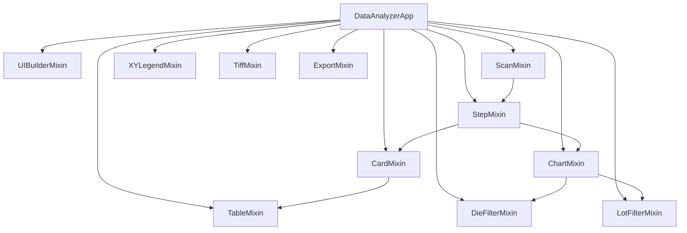

# SKILL 12 — MVC Mixin Architecture & UI Builder

## Overview

Implements a Mixin-based architecture for a large PySide6 application, splitting a monolithic `QMainWindow` into 12+ focused controller classes. Each Mixin handles one domain concern while sharing state through `self` (the main window instance).

**When to use:** When a single-file GUI application grows beyond ~500 lines and needs decomposition without a full framework.

## Architecture

### Class Hierarchy

```python
# Source: main.py
class DataAnalyzerApp(
    UIBuilderMixin,       # UI construction (983 lines)
    QMainWindow,           # Qt base
    ScanMixin,             # Folder scan + data load
    StepMixin,             # Recipe step navigation
    CardMixin,             # StatCard updates
    TableMixin,            # Data table management
    ChartMixin,            # Chart rendering
    XYLegendMixin,         # XY Scatter legend
    DieFilterMixin,        # Die checkbox filter
    LotFilterMixin,        # Lot checkbox filter
    TiffMixin,             # TIFF viewer
    ExportMixin,           # CSV/Excel/PDF export
):
    def __init__(self):
        super().__init__()
        self._build_ui()         # From UIBuilderMixin
        self._restore_settings() # From settings
```

### Dependency Graph



## Core Patterns

### 1. Mixin Pattern (Shared self)

```python
# Source: ui/controllers/card_controller.py
class CardMixin:
    # No __init__ — uses main window's self
    def _update_cards(self, data, recipe):
        d_x = filter_by_method(data, 'X')
        s_x = compute_statistics(d_x)
        # Access shared state via self
        self.card_x.update_stats(s_x['mean'], ...)  # self.card_x from UIBuilderMixin
        self.logger.info(...)                          # self.logger from UIBuilderMixin
        self.settings.get('spec_limits', {})           # self.settings from main
```

**Key design:** Mixins access each other's state through `self` — no dependency injection needed. The main class is the composition root.

### 2. UIBuilderMixin (Central UI Construction)

```python
# Source: ui/controllers/ui_builder_mixin.py (983 lines)
class UIBuilderMixin:
    def _build_ui(self):
        # 1. Central widget + main splitter
        # 2. Left panel: stat cards + log/table tabs
        # 3. Right panel: chart tabs
        # 4. Bottom: die filter + lot filter
        # 5. Menu bar + status bar
        
    def _add_chart(self, label, chart_type='static'):
        # Register chart widget by label
        if chart_type == 'static':
            w = ChartWidget()
        else:
            w = InteractiveChartWidget()
        self.chart_widgets[label] = w
        self.chart_tab.addTab(w, label)
```

### 3. Signal-to-Mixin Wiring

```python
# Source: ui/controllers/ui_builder_mixin.py
# Signals connect to Mixin methods freely:
self.browse_btn.clicked.connect(self._browse_folder)           # → ScanMixin
self.export_csv_btn.clicked.connect(self._export_csv)          # → ExportMixin
self.raw_table.cellDoubleClicked.connect(self._on_row_double_click)  # → TiffMixin
```

### 4. Chart Registration System

```python
# Source: ui/controllers/ui_builder_mixin.py
# Charts registered during _build_ui:
self._add_chart('Contour X', 'static')
self._add_chart('Contour Y', 'static')
self._add_chart('Vector Map', 'static')
self._add_chart('XY Scatter', 'interactive')
self._add_chart('Lot Trend', 'interactive')
self._add_chart('Histogram', 'interactive')
self._add_chart('Pareto', 'interactive')
self._add_chart('Correlation', 'interactive')
self._add_chart('3D Surface X', 'interactive')
self._add_chart('3D Surface Y', 'interactive')
self._add_chart('🔬 TIFF', 'interactive')
```

### 5. Step Navigation Flow

```python
# Source: ui/controllers/step_controller.py → StepMixin
# _build_nav() → creates QPushButtons for each recipe
# _select_step(idx) → loads data → calls _display_result()
# _display_result() → orchestrates: _update_cards() + _update_tables() + _update_charts()
```

### 6. QTimer Deferred Rendering

```python
# Source: ui/controllers/chart_controller.py → ChartMixin
def _update_charts(self, data, result, recipe):
    # Render critical charts first (contour, scatter)
    self._update_contour(...)
    self._update_scatter(...)
    # Defer remaining charts to prevent UI freeze
    QTimer.singleShot(50, lambda: self._update_charts_remaining(data, result, recipe))
```

### 7. Dialogs

| Dialog | Source | Purpose |
|--------|--------|---------|
| `SpecConfigDialog` | `ui/dialogs/spec_config_dialog.py` | Display current Spec settings (read-only) |
| `RepeatContourDialog` | `ui/dialogs/repeat_contour_dialog.py` | Grid of contour maps per repeat |
| `GuideDialog` | `ui/dialogs/guide_dialog.py` | In-app analysis guide (HTML) |

### 8. ChecklistBorderDelegate

```python
# Source: ui/controllers/ui_builder_mixin.py
class _ChecklistBorderDelegate(QStyledItemDelegate):
    # Draws a left-side accent bar on checklist table rows
    def paint(self, painter, option, index):
        super().paint(painter, option, index)
        painter.fillRect(option.rect.x(), option.rect.y(),
                        3, option.rect.height(), QColor(ACCENT))
```

## Pitfalls & Gotchas

- **MRO (Method Resolution Order):** With 12+ mixins, Python's MRO matters. Place `QMainWindow` after `UIBuilderMixin` for correct `super().__init__()` chain.
- **Shared state fragility:** All mixins share `self` — naming conflicts are possible. Use descriptive prefixes (`_dev_x`, `_trend_data_x`, `_die_checkboxes`).
- **No `__init__` in Mixins:** Mixins must not define `__init__()`. All state initialization happens in UIBuilderMixin's `_build_ui()` or main's `__init__()`.
- **Circular calls:** `_update_cards()` → `_refresh_step_buttons()` → must not call `_select_step()` again. Guard with flags.
- **File count:** UIBuilderMixin alone is ~983 lines. Keep it as the single UI construction file; don't split further.

## Testing Checklist

- [ ] App launches successfully with all mixins composed
- [ ] Each mixin's methods are callable from the main window instance
- [ ] Chart registration produces correct number of tabs
- [ ] Step button click triggers full update chain (cards → tables → charts)
- [ ] Dialog opens and closes without affecting main window state

## Related Files

- `src/main.py` — App entry point + class composition (161 lines)
- `src/ui/controllers/ui_builder_mixin.py` — UI construction (983 lines)
- `src/ui/controllers/scan_controller.py` — ScanMixin (147 lines)
- `src/ui/controllers/step_controller.py` — StepMixin (235 lines)
- `src/ui/controllers/card_controller.py` — CardMixin (60 lines)
- `src/ui/controllers/table_controller.py` — TableMixin (236 lines)
- `src/ui/controllers/chart_controller.py` — ChartMixin (218 lines)
- `src/ui/controllers/xy_legend_controller.py` — XYLegendMixin (135 lines)
- `src/ui/controllers/die_filter_controller.py` — DieFilterMixin (161 lines)
- `src/ui/controllers/lot_filter_controller.py` — LotFilterMixin (144 lines)
- `src/ui/controllers/tiff_controller.py` — TiffMixin (140 lines)
- `src/ui/controllers/export_controller.py` — ExportMixin (63 lines)
- `src/ui/dialogs/spec_config_dialog.py` — Spec dialog (70 lines)
- `src/ui/dialogs/repeat_contour_dialog.py` — Repeat contour (118 lines)
- `src/ui/dialogs/guide_dialog.py` — Help dialog (294 lines)
