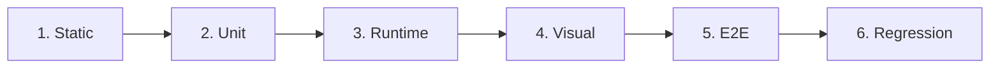

# SKILL 16 — Verification & QA

## Overview

Standardizes the verification process after skill-based implementation. Provides 6-layer checklists for code quality, runtime behavior, chart accuracy, data pipeline integrity, and skill document quality.

**When to use:** After completing any implementation work based on a skill document.

## Verification Layers



## Layer 1: Static Code Analysis

```powershell
# Syntax check
python -m py_compile src/module_name.py

# Import verification
cd src && python -c "import core; import charts; import ui.theme"
```

- Korean font setup in all chart modules
- `plt.rcParams['axes.unicode_minus'] = False` present
- Theme constants from `ui.theme`, not hardcoded

## Layer 2: Unit Validation

```python
# Statistics (SKILL 07)
from core.statistics import compute_statistics
result = compute_statistics([{'value': 10}, {'value': 20}, {'value': 30}])
assert result['count'] == 3 and result['mean'] == 20.0

# Die Analysis (SKILL 08)
from core.die_analysis import extract_die_number
assert extract_die_number('0001_X000_Y000') == 0

# CSV Parser (SKILL 06)
from core.csv_loader import scan_lot_folders
lots = scan_lot_folders(test_path)
assert len(lots) > 0
```

## Layer 3: Runtime Test

**App Launch:** `cd src && python main.py`
- [ ] Window opens, dark theme applied, no console errors

**Folder Scan:**
- [ ] Browse → scan → Step buttons appear → Summary table populates

**Step Navigation:**
- [ ] Each Step → StatCards update → Charts render → Pass/Fail badges correct

## Layer 4: Visual Chart Inspection

**Contour:** color gradient, colorbar, die dots, annotations
**Vector:** arrow direction, scale slider, wafer boundary
**3D Surface:** renders, Z-scale slider, model selection, colorbar
**Interactive (PyQtGraph):** crosshair, hover info, zoom/pan, spec lines
**Histogram:** bars, normal curve, σ lines
**Pareto:** descending bars, cumulative %, 80% line

## Layer 5: End-to-End Pipeline

```
CSV → parse_csv() → batch_load() → detect_outliers()
    → compute_statistics() → compute_deviation_matrix()
    → plot_wafer_contour() / create_scatter_widget()
    → ChartWidget / InteractiveChartWidget
```

1. Load known dataset → verify row count
2. Statistics → match manual calculation
3. Deviation matrix → die count correct
4. Export CSV/Excel/PDF → verify output

## Layer 6: Regression Check

```python
baseline = {'x_mean': stats_x['mean'], 'x_range': dev_x['overall_range']}
for key, expected in baseline.items():
    assert abs(new_results[key] - expected) < 0.001
```

## Skill Document Verification

- [ ] YAML frontmatter parses (`name`, `description` present)
- [ ] All "Related Files" paths exist on disk
- [ ] Code examples match source (spot-check 3)
- [ ] Every source file covered by ≥1 skill
- [ ] `registry.json` matches directory structure

## Report Template

```markdown
# Verification Report
**Date:** YYYY-MM-DD | **Skill(s):** [list] | **Scope:** [changes]

| Layer | Status | Notes |
|-------|--------|-------|
| Static | ✅/❌ | |
| Unit | ✅/❌ | |
| Runtime | ✅/❌ | |
| Visual | ✅/❌ | |
| E2E | ✅/❌ | |
| Regression | ✅/❌ | |
```

## Pitfalls

- **PSPylib:** TIFF tests fail without it — skip gracefully
- **OpenGL:** 3D tests may fail headless — mark manual-only
- **matplotlib backend:** Set `matplotlib.use("Agg")` in test scripts
