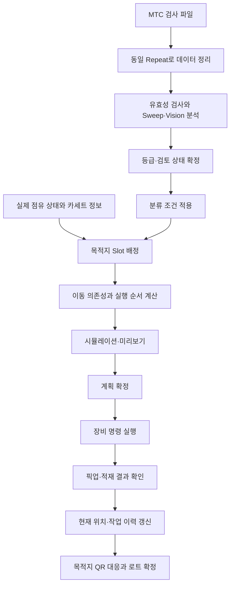

# MTC Inspection 분석 및 자동 분류·적재·하드웨어 제어 확장 설계

| 항목 | 내용 |
|---|---|
| 작성일 | 2026-10-08 |
| 대상 프로젝트 | MC QR Code Chip Carrier Manager / NX-QR-Chip-Carrier-Manager |
| 분석 기준 커밋 | `ccb50675b022704b42f230b2d76fa2e85b2bb061` |
| 분석 대상 | MTC 결과 파서, Inspection 판정·Grouping, ATX 결과 처리, Pass Pool, QR 리더기 통신·위치 대응, DB |
| 문서 목적 | 현재 구현을 설명하고 검사 결과 기반 자동 분류·물리 적재·장비 제어의 구현 방향을 구체화 |
| 구현 상태 | 이 문서의 자동 적재·장비 실행 설계는 제안이며 아직 구현하지 않음 |
| 검증 근거 | 소스 확인, 기존 관련 테스트 76개 통과, 추가 합성 입력·fixture 기반 문제 재현 |

## 목차

1. [목표와 분석 결론](#1-목표와-분석-결론)
2. [분석 범위와 근거의 구분](#2-분석-범위와-근거의-구분)
3. [현재 소스 구조와 책임](#3-현재-소스-구조와-책임)
4. [MTC 입력 데이터와 파싱](#4-mtc-입력-데이터와-파싱)
5. [기준 캔틸레버와 상대 편차](#5-기준-캔틸레버와-상대-편차)
6. [등급 사다리와 기본 템플릿](#6-등급-사다리와-기본-템플릿)
7. [Sweep 형상 분석](#7-sweep-형상-분석)
8. [Vision 파손 분석](#8-vision-파손-분석)
9. [Inspection UI와 실행 상태](#9-inspection-ui와-실행-상태)
10. [Grouping·로트·ATX·Pass Pool의 관계](#10-grouping로트atxpass-pool의-관계)
11. [위치 번호 체계와 QR 대응](#11-위치-번호-체계와-qr-대응)
12. [확인된 문제와 자동화 전 보완 사항](#12-확인된-문제와-자동화-전-보완-사항)
13. [목표 시스템의 처리 흐름](#13-목표-시스템의-처리-흐름)
14. [팁 식별·위치·판정 데이터 설계](#14-팁-식별위치판정-데이터-설계)
15. [자동 분류 정책](#15-자동-분류-정책)
16. [목적지 배정 알고리즘](#16-목적지-배정-알고리즘)
17. [이동 순서·위치 교환·임시 보관](#17-이동-순서위치-교환임시-보관)
18. [하드웨어 통신과 제어 계약](#18-하드웨어-통신과-제어-계약)
19. [실행 상태·중단·복구·DB 일관성](#19-실행-상태중단복구db-일관성)
20. [UI 확장과 기존 코드 연결](#20-ui-확장과-기존-코드-연결)
21. [단계별 구현 계획과 완료 조건](#21-단계별-구현-계획과-완료-조건)
22. [테스트·현장 검증 계획](#22-테스트현장-검증-계획)
23. [구현 전 확인할 장비·운영 정보](#23-구현-전-확인할-장비운영-정보)
24. [재현 방법과 참고 자료](#24-재현-방법과-참고-자료)

## 1. 목표와 분석 결론

### 1.1 사용자가 원하는 최종 동작

현재 프로그램은 MTC 검사 후 생성된 파일을 읽고 팁별 결과를 분석한다. 앞으로는 그 결과를 바탕으로 실제 팁의 위치까지 바꾸는 것을 목표로 한다.

- 불량으로 판정된 팁을 지정한 한쪽 Port에 모은다.
- 산업용·연구용 등 원하는 등급의 팁을 하나의 카세트에 모은다.
- 특정 Frequency/Q 범위 등 사용자가 원하는 분류 조건으로 카세트를 구성한다.
- 분류·적재가 끝난 실제 배치에 맞춰 QR, 측정 결과, 로트 정보를 연결한다.
- 프로그램이 장비와 직접 통신하여 이동·픽업·적재를 실행하고 완료 여부를 확인한다.

이 목표는 다음 네 문제로 나누어 다뤄야 한다.

| 문제 | 답해야 하는 질문 | 현재 구현 |
|---|---|---|
| 품질 판정 | 이 팁은 어떤 등급이며 왜 그렇게 판정했는가? | Inspection에 구현됨 |
| 분류·배치 | 어떤 조건의 팁을 어느 카세트·Slot에 모을 것인가? | 로트 파일 묶기는 구현, 실물 목적지 배정은 없음 |
| 실행 순서 | 목적지가 점유되어 있을 때 어떤 순서로 옮길 것인가? | 없음 |
| 장비 제어 | 명령을 어떻게 전달하고 실제 완료를 어떻게 확인할 것인가? | QR 리더기 통신만 구현, MTC 이동 제어는 없음 |

### 1.2 핵심 결론

기존 Inspection의 판정 결과를 자동 분류의 입력으로 재사용할 수 있다. 새로 필요한 핵심은 **확정 판정 → 목적지 배정 → 이동 순서 → 장비 실행 → 실제 위치 갱신**이다.

현재 Grouping은 선택한 팁의 결과 파일을 로트 폴더로 복사하는 기능이다. 로트 폴더를 만들었다는 사실은 실물 카세트에 적재가 끝났다는 뜻이 아니다.

먼저 구현할 범위는 **검사 결과를 받아 이동 계획과 이동 후 배치를 만드는 시뮬레이션**이 적절하다. 이 단계에서는 장비 프로토콜이 없어도 빈 공간, 충돌, 용량 부족, 위치 교환을 검증할 수 있다.

실제 장비 연결은 MTC의 외부 제어 인터페이스, 이동 가능한 위치 범위, 픽업·적재 완료 신호를 확인한 뒤 진행해야 한다. 현재 소스만으로 장비가 ATX 사이를 이동할 수 있다고 판단할 수는 없다.

## 2. 분석 범위와 근거의 구분

### 2.1 근거 분류

이 문서는 다음 세 종류의 내용을 구분한다.

| 구분 | 의미 |
|---|---|
| 현재 구현 | 기준 커밋의 소스에서 직접 확인한 동작 |
| 재현 결과 | fixture 또는 합성 입력으로 실제 함수를 호출해 확인한 결과 |
| 설계 제안 | 향후 구현 방향이며 아직 코드·장비로 검증하지 않은 내용 |

예시의 목적지 주소, 모델명, Frequency/Q 범위, 이동 명령 형식은 설계 설명용이다. 장비의 실제 명령이나 확정 생산 규격으로 사용하지 않는다.

### 2.2 확인한 범위

- `src/core/inspection/`의 데이터 수집·분석·판정·로트 생성 코드.
- Inspection 컨트롤러, 결과표, 레이아웃 화면.
- ATX 폴더 파서, 슬롯 모델, Pass Pool.
- QR 리더기의 TCP 클라이언트와 셀 대응 로직.
- SQLite 스키마 및 설정 저장 구조.
- Inspection 관련 기존 테스트 9개 파일, 총 76개 테스트.
- 실런에서 발췌한 `tests/fixtures/mtc/20260909/`의 7개 슬롯.

### 2.3 확인하지 않은 범위

- MTC 설비 자체의 제어 소스, PLC 프로그램, 제조사 API/SDK.
- 실제 장비에서 이동·픽업·적재 명령을 실행하는 실험.
- 실제 파손 샘플을 이용한 Vision 검출 성능 평가.
- 실제 카세트 교체·지그 장착·ATX 간 이송 가능 여부.
- 제조사의 안전 제어·인터록 구성과 외부 명령 권한.

기존 [Inspection 설계 문서](inspection-design.md)는 85슬롯 실런 결과를 기록하고 있다. 이번 함수 호출 검증은 저장소의 7슬롯 fixture를 대상으로 했으며, 과거의 85슬롯 결과를 새로 재검증한 것은 아니다.

### 2.4 작업 환경

프로젝트 지침의 기본 경로 `C:\Users\Spare\Desktop\03. Program\새 폴더`는 분석 시 존재하지 않았다. 현재 열린 `NX-QR-Chip-Carrier-Manager`에서 작업했다.

분석 시작 시 브랜치는 `main`이었고 `origin/main`과 같았다. 기존 미추적 `docs/word/`는 분석·문서 작업의 대상에서 제외했다.

## 3. 현재 소스 구조와 책임

| 파일 | 핵심 요소 | 책임 |
|---|---|---|
| [mtc_parser.py](../src/core/inspection/mtc_parser.py) | `MtcSlot`, `MtcRun`, `load_mtc_run()` | MTC 런 파일을 슬롯 단위로 합치고 원본 경로 연결 |
| [reference.py](../src/core/inspection/reference.py) | `auto_reference()`, `compute_offsets()` | 기준 슬롯 선택과 상대 편차 계산 |
| [templates.py](../src/core/inspection/templates.py) | `ITEM_CATALOG`, `default_template()`, `normalize_template()` | 등급·검사항목·임계값 정의 및 정규화 |
| [sweep_shape.py](../src/core/inspection/sweep_shape.py) | `SweepShape`, `analyze_sweep()` | 수치 곡선 분석과 형상 점수 계산 |
| [vision_check.py](../src/core/inspection/vision_check.py) | `TipMeasure`, `VisionCheck`, `check_vision()` | 이미지 실루엣 기반 파손 추정 |
| [grading.py](../src/core/inspection/grading.py) | `SlotVerdict`, `grade_run()`, `regrade()` | 지표를 등급 규격에 대입하고 최종 표시 등급 계산 |
| [lot_builder.py](../src/core/inspection/lot_builder.py) | `build_lots()`, `write_lot_folder()`, `write_report_csv()` | 로트 폴더·리포트 생성 |
| [check_sheet.py](../src/core/inspection/check_sheet.py) | `write_check_sheet()` | 기존 XLSX 체크시트 템플릿의 결과 셀 갱신 |
| [inspection_mixin.py](../src/ui/controllers/inspection_mixin.py) | `InspectionWorker`, `InspectionMixin` | 폴더 열기, 판정 실행, 수동 지정, Grouping 연결 |
| [inspection_page.py](../src/ui/widgets/inspection_page.py) | `InspectionPage` | 결과표·상세·템플릿·Grouping 화면 |
| [inspection_layout_window.py](../src/ui/widgets/inspection_layout_window.py) | `InspectionLayoutWindow` | ATX·Port·Slot의 검사 결과를 실물 배치 형태로 표시 |
| [atx_parser.py](../src/core/atx_parser.py) | `load_atx_folder()` | 로트 결과의 `Summary.csv`와 Sweep 이미지 읽기 |
| [models.py](../src/core/models.py) | `SlotData`, `MeasurementSet` | ATX/Manual 공용 데이터 모델 |
| [pass_pool_mixin.py](../src/ui/controllers/pass_pool_mixin.py) | `_pool_pass_items()`, `_pool_assemble_carrier()` | Frequency/Q 통과 슬롯 표시·QR 태깅·Cassette CSV 생성 |
| [slot_mapper.py](../src/core/slot_mapper.py) | `parse_slot_code()`, `slot_to_grid()` | 원본 슬롯 코드와 표시 좌표 변환 |
| [keyence_client.py](../src/core/qr_reader/keyence_client.py) | `KeyenceClient` | QR 리더기 TCP 통신·판독·명령 응답·타임아웃 |
| [slot_assigner.py](../src/core/qr_reader/slot_assigner.py) | `cell_to_port_slot()`, `build_plan()` | QR 판독 셀을 로드된 슬롯에 대응 |
| [database.py](../src/core/database.py) | `init_db()`, 측정·설정 저장 함수 | 측정 세트·슬롯·설정 영속화 |

현재 품질 분석 함수들은 UI와 비교적 잘 분리되어 있다. 새로운 계획 계산도 Qt·DB·통신에 의존하지 않는 함수로 시작하면 기존 fixture와 함께 검증하기 쉽다.

## 4. MTC 입력 데이터와 파싱

### 4.1 런 폴더 구성

```text
20260909/
├── PSPD.txt
├── FreqSweep.txt
├── FreqSweep_ZoomOut.txt
├── Vision.txt
├── Angle.txt
├── Exchange.txt
├── FreqSweep/
│   └── Repeat1/
│       └── TipExchanger1/
│           ├── Port1_1.txt
│           ├── Port1_1.jpg
│           ├── Port1_1_ZoomOut.txt
│           └── Port1_1_ZoomOut.jpg
└── Vision/
    └── Repeat1/
        └── TipExchanger1/
            ├── Port1_1_pickUp.png
            └── Port1_1_putBack.png
```

### 4.2 파일별 데이터

| 입력 파일 | 주요 값 | 현재 사용 |
|---|---|---|
| `PSPD.txt` | A+B, A-B, C-D | 기준 대비 전압 편차 판정 |
| `FreqSweep.txt` | Frequency, Set Point, Amplitude, Drive, Q | 원시 측정값 및 등급 판정 |
| `FreqSweep_ZoomOut.txt` | 광대역 측정 요약 | 상세·원본 보존 |
| `Vision.txt` | Tip Focus, Tip X/Y, Match Score | 상대 위치 편차·Match Score 판정 |
| `Angle.txt` | CantileverNo, Angle | 기준 대비 각도 판정 |
| `Exchange.txt` | Delta Z | 데이터로 읽지만 기본 등급 카탈로그에는 없음 |
| 슬롯별 Sweep TXT | Frequency·Amplitude 곡선 | 형상 점수 계산 |
| 슬롯별 pickUp PNG | 픽업 시 이미지 | 자동 파손 추정 |
| 슬롯별 putBack PNG | 복귀 시 이미지 | 화면 표시·로트 복사 |

Set Point, Amplitude, Tip Focus, Delta Z는 파싱되지만 현재 등급 카탈로그의 독립 판정 항목은 아니다. 특히 Delta Z를 읽는다는 사실이 Z축을 제어한다는 뜻은 아니다.

### 4.3 병합 키와 슬롯 식별

현재 병합 키는 다음과 같다.

```python
key = (atx, port, slot)
code = f"{atx}{port}{slot:02d}"
cantilever_no = f"{run_id}_{code}"
```

예를 들어 `1102`는 ATX1·Port1·Slot2, `3212`는 ATX3·Port2·Slot12이다.

`MtcSlot`에는 `repeat` 필드가 있지만 병합 키에는 Repeat가 포함되지 않는다. 따라서 다중 Repeat 입력은 별도로 정책을 정해야 한다. 상세 문제는 12장을 참조한다.

### 4.4 슬롯 존재 판정

슬롯은 다음 입력의 합집합으로 구성한다.

```text
PSPD ∪ FreqSweep ∪ FreqSweep_ZoomOut ∪ Vision ∪ Angle
```

`Exchange.txt`는 이미 생성된 슬롯의 Delta Z만 채운다. 빈 슬롯까지 행이 존재할 수 있어 슬롯 생성에 사용하지 않는다.

이 구조가 나타내는 것은 **검사 기록의 존재 여부**다. 기록이 없는 위치가 실물로 비어 있는지, 검사를 실패했는지, 아직 검사하지 않았는지는 구분하지 못한다.

향후 자동 적재 목적지는 검사 결과의 빈 부분을 이용해 추정하지 않고 장비·센서·검증된 작업자 입력 등의 점유 확인을 받아야 한다. QR 미판독도 빈 칸의 증거가 될 수 없다.

### 4.5 결측값과 인코딩

- 텍스트 인코딩은 `utf-8-sig → cp949 → euc-kr → latin-1` 순으로 시도한다.
- 헤더의 단위 괄호를 제거하고 `A+B` 등을 정규화된 필드명으로 바꾼다.
- 없는 값·변환되지 않는 값은 일반적으로 `None`이다.
- 이미지·곡선 경로는 실제 파일이 존재할 때만 연결한다.
- `float("nan")`처럼 변환 자체가 성공하는 비유한 값은 현재 별도로 제거하지 않는다.

## 5. 기준 캔틸레버와 상대 편차

### 5.1 자동 기준 선택

`auto_reference()`는 `(ATX, Port, Slot)` 순서의 첫 후보를 선택한다.

첫 번째 후보 조건은 다음과 같다.

- Frequency가 있다.
- Tip X/Y가 있다.
- A+B와 Angle이 있다.
- Match Score가 99 이상이다.

조건에 맞는 슬롯이 없으면 Frequency와 Tip X/Y만 있는 첫 슬롯을 선택한다. 이것도 없으면 기준은 `None`이다.

이 선택은 필요한 요약값의 존재와 Match Score를 확인한다. 후보의 Sweep 형상 점수나 실제 pickUp 이미지의 정상 여부를 먼저 검증하는 방식은 아니다. 기본 기준을 정한 후 전체 Sweep/Vision 분석을 수행한다.

향후 자동 운전에서 기준은 다음 정보와 함께 확정하는 편이 적절하다.

- 기준으로 사용한 검사 레코드와 Repeat.
- 기준 슬롯의 원시값과 이미지 분석 결과.
- 자동 선택인지 작업자 지정인지.
- 기준 선택 규칙과 확정 시점.

### 5.2 계산식

```text
A+B 편차 = 측정 A+B − 기준 A+B
A-B 편차 = 측정 A-B − 기준 A-B
C-D 편차 = 측정 C-D − 기준 C-D
X Offset = (기준 Tip X − 측정 Tip X) × um_per_pixel
Y Offset = (기준 Tip Y − 측정 Tip Y) × um_per_pixel
Angle Offset = 측정 Angle − 기준 Angle
```

기본 `um_per_pixel`은 0.345이다. 소스 주석상 기존 화면 값으로 역산한 값이다.

이 픽셀 변환 계수는 검사 편차 계산용이다. 실제 장비 이동 좌표에 사용하려면 카메라·지그·기구 좌표계의 별도 교정과 제조사 좌표 정의가 필요하다.

## 6. 등급 사다리와 기본 템플릿

### 6.1 등급 평가

평가 순서는 `industrial → research → recheck`이며 모든 등급에서 실패하면 `reject`다.

각 등급에서는 활성화된 항목을 모두 검사한다. 비활성 항목은 통과로 취급한다. 활성 항목의 필요한 값이 `None`이면 해당 항목은 실패한다.

첫 통과 등급을 반환하면서 다른 등급의 실패 항목도 계속 기록한다. 따라서 등급과 실패 근거를 함께 조회할 수 있다.

### 6.2 판정 종류

| 종류 | 항목 | 조건 |
|---|---|---|
| 기준 대비 offset | A+B, A-B, C-D | `abs(value - reference) <= offset` |
| 범위 | Drive, Q, Frequency, X/Y Offset | `min <= value <= max`; 미지정 경계는 무제한 |
| 각도 offset | Angle | `abs(angle - reference_angle) <= offset` |
| 최소값 | Sweep Shape, Vision Match | `value >= min` |

실제 비교는 경계값을 포함한다. 화면의 `formula_text()`는 일부 항목에 `<`를 표시하므로 표시식과 실제 비교 연산은 일치하지 않는 부분이 있다. 이는 소스에서 확인한 표시 문제이며, 이번 추가 재현 항목과는 구분한다.

### 6.3 기본 AC160 템플릿

| 항목 | 산업용 | 연구용 | 재검사 | 기본 활성 |
|---|---|---|---|---|
| A+B offset (V) | 1.0 | 1.5 | 2.0 | 켜짐 |
| A-B offset (V) | 0 | 0 | 0 | 꺼짐 |
| C-D offset (V) | 0 | 0 | 0 | 꺼짐 |
| Drive (%) | 0~80 | 0~80 | 0~80 | 꺼짐 |
| Q | 200~700 | 100~800 | 50~1000 | 켜짐 |
| Frequency (kHz) | 200~400 | 150~450 | 100~500 | 켜짐 |
| X Offset (µm) | −10~10 | −10~10 | −10~10 | 꺼짐 |
| Y Offset (µm) | −10~10 | −10~10 | −10~10 | 꺼짐 |
| Angle offset (°) | 3 | 5 | 8 | 켜짐 |
| Sweep Shape | 70 이상 | 50 이상 | 30 이상 | 켜짐 |
| Vision Match (%) | 95 이상 | 90 이상 | 80 이상 | 켜짐 |

이 값은 현재 프로그램의 기본 설정이다. 모든 모델·장비·공정에서 검증된 공통 생산 규격을 의미하지 않는다.

### 6.4 수동 지정과 파손 우선순위

현재 `SlotVerdict.grade`의 실제 순서는 다음과 같다.

```text
수동 등급이 있으면 수동 등급 반환
그 외에는 broken이면 reject 반환
그 외에는 사다리 등급 반환
```

따라서 파손 표시가 있어도 수동으로 산업용을 지정하면 최종 등급은 산업용이다. 다만 `error_label`은 Broken을 표시한다.

이 동작은 기존 수동 검토 기능의 정책이다. 자동 적재에서는 별도의 실행 적합성 검사를 두어 최종 등급 문자열만으로 제품 카세트에 보내지 않도록 해야 한다. 기존 수동 기능의 의미를 바꾸려면 사용자 정책을 먼저 정해야 한다.

### 6.5 Error 열의 의미

현재 Error 열은 다음 우선순위를 따른다.

1. 파손이면 `Broken`.
2. Frequency가 없으면 `No Sweep`.
3. 나머지는 산업용 기준의 실패 항목.

연구용·재검사로 정상 분류된 슬롯에도 산업용 기준 실패 항목이 표시될 수 있다. Error가 있다는 이유만으로 모든 팁을 불량 Port로 보내면 안 된다.

자동 분류는 `grade`, 파손 상태, 데이터 유효성, 수동 검토 상태를 구조화된 값으로 읽어야 한다. 화면의 Error 문자열을 파싱하는 방식은 적절하지 않다.

## 7. Sweep 형상 분석

### 7.1 입력과 접근 방식

슬롯별 줌인 TXT와 ZoomOut TXT의 Frequency·Amplitude를 이용한다. JPG 모양을 이미지 비교하는 방식이 아니다.

현재 `analyze_sweep()`는 줌인 데이터가 5점 미만이면 분석 불가를 반환한다. 5점 이상이면 `available=True`로 두고 아래 지표를 계산한다.

### 7.2 지표와 감점

| 지표 | 계산 방식 | 감점 |
|---|---|---|
| 피크 수 | 3점 평활화 후 상대 높이 30%·prominence 8% 조건의 국소 최대 검출 | 추가 피크마다 35, 최대 70 |
| Lorentzian 적합도 | f0·baseline·진폭·gamma 격자 탐색으로 R² 계산 | `(1-R²) × 300`, 최대 45 |
| 좌우 비대칭 | 반높이 교차점까지 좌우 거리의 큰 값/작은 값 | `(비율-1.15) × 40`, 0~20 |
| 광대역 부피크 | 줌인 주피크 ±10 kHz 밖 최대 진폭/안쪽 최대 진폭 | `(비율-0.5) × 40`, 0~30 |

```text
score = clamp(100 − 감점 합계, 0, 100)
```

Lorentzian 모델은 다음과 같다.

```text
A(f) = baseline + (A0 - baseline) / (1 + ((f - f0) / gamma)^2)
```

점수 외에 피크 주파수, 피크 진폭, R², 비대칭, 부피크 비율·주파수, 감점 근거를 보관한다.

### 7.3 검증한 fixture 결과

| 슬롯 | 특성 | Sweep 점수 | 최종 등급 |
|---|---|---:|---|
| `1101` | 정상 기준 슬롯 | 86.22 | 산업용 |
| `1102` | 잡음·다중 피크 | 0.00 | 불량 |
| `1111` | 줌인 측정 없음 | 분석 불가 | 불량 |
| `1204` | 광대역 부피크 | 58.59 | 재검사 |
| `1206` | 줌인 측정 없음 | 분석 불가 | 불량 |
| `3212` | 형상 왜곡·강한 부피크 | 18.73 | 불량 |
| `4111` | 줌인 측정 없음 | 분석 불가 | 불량 |

최종 등급에는 Sweep 외에 다른 항목도 작용한다. Sweep 점수만으로 위 등급을 설명할 수는 없다.

### 7.4 자동 운전에 필요한 유효성 조건

현재 코드에서는 계산되지 않은 지표가 감점에 반영되지 않을 수 있다. 평탄 곡선 문제는 12.1절에서 재현 결과와 함께 설명한다.

보완안은 먼저 분석 유효성을 판정한 뒤, 유효한 곡선에 점수를 부여하는 것이다.

- 주파수·진폭이 유한한 수치인지.
- 주파수 범위와 순서가 정상인지.
- 진폭 변화가 있어 실제 피크 분석이 가능한지.
- 피크를 검출했는지, 필수 적합도 계산이 가능한지.
- ZoomOut이 필요한 정책에서 광대역 검사가 완료되었는지.

유효성 임계값은 실제 측정 노이즈와 정상·불량 샘플로 정해야 한다. 이 문서에서는 새로운 수치 임계값을 확정하지 않는다.

## 8. Vision 파손 분석

### 8.1 현재 이미지 처리

`measure_tip()`는 밝은 배경에 어두운 칩 몸체와 캔틸레버가 아래로 보이는 이미지를 전제로 한다.

1. 픽셀 밝기 110 미만을 어두운 픽셀로 간주한다.
2. 행의 어두운 픽셀 비율이 50% 이상인 마지막 행을 몸체 하단 기준선으로 찾는다.
3. 기준선 아래 이미지 높이의 3% 구간을 건너뛴다.
4. 높이의 10% 구간까지 어두운 열 범위를 찾아 캔틸레버 밴드를 정한다.
5. 폭의 2% 여유를 추가한다.
6. 밴드 안 마지막 유효한 어두운 행으로 길이를 구하고 어두운 픽셀 수로 면적을 구한다.

### 8.2 파손 조건

기준 이미지가 있으면 다음 조건을 적용한다.

```text
측정 길이 / 기준 길이 < 0.70 → 파손
그 외에 측정 면적 / 기준 면적 < 0.60 → 파손
```

기준이 없으면 길이/이미지 높이가 0.15 미만인지 검사한다.

Match Score는 파손 비율과 별개의 값이다. 등급 사다리의 `vision_match`에는 `Vision.txt`의 Match Score를 사용한다.

### 8.3 검출 범위와 제한

이 로직은 캔틸레버 실루엣의 길이·면적 손실을 이용한 파손 추정이다. 소스 구조상 미세한 팁 끝 형상·오염·코팅 손상 등 모든 결함을 판정하는 검사로 확대 해석할 수 없다.

현재 fixture의 이미지들은 기존 테스트에서 온전한 팁으로 확인한다. 파손 검출 테스트는 정상 이미지의 일부를 지우거나 폭을 줄인 합성 입력을 포함한다. 실제 파손 샘플 검증은 기존 설계 문서에도 후속 작업으로 남아 있다.

기준과 대상 이미지의 촬영 배율·해상도·조명이 달라지는 경우도 검증해야 한다. 실제 구현은 길이·면적의 픽셀값을 직접 비교하므로 동일한 촬영 조건을 전제로 검증하는 것이 필요하다.

### 8.4 pickUp과 putBack

자동 파손 판정은 pickUp 이미지를 이용한다. putBack 이미지는 화면 표시와 로트 파일 보존에 사용된다.

putBack 이미지가 존재한다는 사실만으로 현재 적재 완료·팁 존재·정확한 위치를 확인했다고 볼 수 없다. 자동 운전에서 putBack을 완료 검증에 사용할 경우, 별도의 장비 이벤트 대응과 이미지 검증을 정의해야 한다.

## 9. Inspection UI와 실행 상태

### 9.1 현재 사용자 흐름

```text
런 폴더 선택
→ 파일 파싱
→ 기준 슬롯 선택
→ QThread에서 전체 판정
→ 결과표·상세·레이아웃 표시
→ 필요 시 기준/템플릿/수동 등급 변경
→ 재판정
→ 검사 CSV 저장 또는 Grouping
```

`InspectionWorker`가 분석을 수행하고 진행·성공·실패 시그널을 메인 스레드에 보낸다. 템플릿만 바꾸는 재판정은 기존 Sweep/Vision 결과를 재사용한다.

### 9.2 주요 메모리 상태

| 상태 | 의미 |
|---|---|
| `_insp_run` | 현재 열린 런 |
| `_insp_verdicts` | 슬롯별 판정 결과 |
| `_insp_ref`, `_insp_ref_tip` | 기준 슬롯과 기준 이미지 측정 |
| `_insp_grouped` | 원본 코드별 로트 내보내기 기록 |
| `_insp_overrides` | 원본 코드별 수동 등급·파손 지정 |
| `_insp_templates` | 템플릿 목록 |

런을 새로 열면 `_insp_grouped`와 `_insp_overrides`가 초기화된다. 이는 현재 검사 화면의 세션 상태이며 이동 이력 저장소가 아니다.

### 9.3 현재 저장되는 정보

- 검사 템플릿과 마지막 선택 모델.
- 로트 출력 경로·마지막 Batch 문자열·Splitter 크기 등의 설정.
- 사용자가 저장한 검사 CSV.
- 로트 생성 후 ATX 측정 세트·슬롯 데이터.

현재 DB에는 검사 전체 판정, 판정 당시 템플릿 전체 내용, 수동 지정 사유·이력, 실제 이동 명령·실물 위치를 위한 전용 테이블이 없다.

## 10. Grouping·로트·ATX·Pass Pool의 관계

### 10.1 현재 Grouping

Grouping의 후보는 선택 등급과 일치하고 `_insp_grouped`에 없는 슬롯이다. UI의 선택 등급은 산업용과 연구용이다.

예를 들어 계획이 `12M × 2 + 10M × 1 + 5M × 1`이면 필요한 수량은 39개다. `plan_lot_sizes()`는 큰 로트부터 목록을 만들고 `build_lots()`는 현재 후보 순서대로 잘라 사용한다.

현재 순서는 일반적으로 `(ATX, Port, Slot)` 오름차순이다. Frequency 유사도, 이동 거리, 목적지 접근성으로 최적화하지 않는다.

### 10.2 생성되는 결과

```text
P2401002_12M_AC160/
├── Summary.csv
├── FreqSweep/
├── Vision/
└── P2401002_12M_AC160TS.xlsx  # 설정한 체크시트가 있는 경우
```

`Summary.csv`는 Batch·Freq·Q의 3행이며 원래 슬롯 코드를 보존한다. 이미지·곡선 파일은 앞에 로트 내 순번을 붙여 복사한다.

로트 내 순번과 원래 코드가 함께 남지만 물리 목적지의 ATX/Port/Slot은 새로 기록하지 않는다.

### 10.3 체크시트

체크시트는 템플릿 XLSX의 ZIP 내부 XML 셀을 수정하여 이미지와 기존 구조를 보존한다.

현재 로트 체크 결과는 A+B, Unipeak, Noise, Frequency Sweep 등을 산업용 기준 또는 Sweep 결과로 집계한다. 이 문서의 자동 적재 상태·이동 완료 검증은 체크시트의 기존 Pass/Fail과 별개다.

### 10.4 ATX 전달 시 정보와 정밀도

로트 폴더를 만든 뒤 `load_atx_folder()`로 다시 읽어 `MeasurementSet`을 생성한다. Inspection 컨트롤러는 이를 ATX 탭으로 넘기고 DB에 저장한다.

이 모델에는 Frequency, Q, Drive, 원본 슬롯 코드, QR 등의 필드는 있으나 Inspection의 등급·전체 지표·실패 근거를 위한 필드는 없다.

또한 ATX 파서는 `truncate_measurement_value()`를 이용해 Frequency/Q의 소수 부분을 버린다. 예를 들어 Inspection의 284.81은 ATX에서 284가 된다. 향후 소수 범위로 분류하려면 Inspection 원시 정밀도를 기준으로 해야 한다. 기존 표시·반출 정책 변경은 별도의 범위로 결정한다.

### 10.5 Pass Pool

Pass Pool은 Frequency와 Q가 있는 슬롯에 `quality.evaluate_slot()`을 적용한다. 규격이 없는 모델은 측정값이 있으면 통과로 취급한다.

Inspection의 A+B, Angle, Sweep, Vision 전체 조건을 다시 평가하지 않는다. 템플릿 저장 시 산업용 Frequency/Q만 `spec_limits`에 동기화하므로 두 판정 체계는 전체가 일치하지 않는다.

`Cassette 확정 → CSV`는 선택한 최대 12개 슬롯의 데이터를 한 CSV로 내보낸다. 실제 카세트 목적지와 이동 완료를 관리하는 기능은 아니다.

## 11. 위치 번호 체계와 QR 대응

### 11.1 세 가지 위치 체계

| 체계 | 현재 의미 | 예 |
|---|---|---|
| MTC/Inspection 원본 주소 | 검사 당시 ATX·Port·Slot | `ATX3 Port2 Slot12`, 코드 `3212` |
| Pass Pool Port | 폴더·ATX·Port 그룹의 연속 표시 번호 | 화면 `Port7` |
| QR 리더기 셀 | 카세트 판독 화각의 셀 번호 | 셀 1~72 |

Pass Pool 표시 번호는 탭·폴더 순서에 따라 달라질 수 있다. 장비 명령 주소로 사용하면 안 된다.

### 11.2 현재 화면 배치

Inspection 레이아웃은 ATX1 좌상, ATX2 우상, ATX3 좌하, ATX4 우하로 배치한다. 각 ATX 안에서는 Port2가 위, Port1이 아래다.

Port의 슬롯 그리드는 다음과 같다.

```text
화면 위:    09 10 11 12
화면 중간:  05 06 07 08
화면 아래:  01 02 03 04
```

화면 행·열은 표시 좌표다. 기구의 X/Y/Z 좌표와 직접 동일하지 않다.

### 11.3 QR 셀 대응

현재 기본 대응식은 다음과 같다.

```text
port = (cell - 1) // 12 + 1
slot = (cell - 1) % 12 + 1
```

`cell_override`로 셀별 대응을 바꿀 수 있다. QR 보트 배치 코드는 6카세트·72셀 표시를 지원한다.

이 대응식 자체에는 ATX 번호가 없다. UI에서는 로드된 폴더에 여러 ATX가 섞인 경우 대응의 모호함을 막는 처리가 있다. 같은 Port·Slot을 여러 세트가 공유하는 경우에는 대상 세트를 정해야 한다.

### 11.4 주석과 실제 정책의 차이

`slot_assigner.py`의 상단 설명에는 `NO_RECORD`가 전체 적용을 차단한다고 적혀 있지만, 현재 실제 `BLOCKING_STATUSES`는 빈 집합이다. 구현은 레코드가 없는 칸을 경고하고 나머지 적용 가능한 칸을 처리한다.

향후 설계는 설명 주석만 보고 전체 프레임이 차단된다고 가정해서는 안 된다. QR 입력의 부분 적용 정책과 자동 이동의 점유 확인 정책도 분리해야 한다.

### 11.5 이동 후 필요한 대응

예를 들어 원본 `3212` 팁이 목적지 카세트 Slot3으로 이동하면 다음 정보를 모두 유지해야 한다.

```text
검사 출처: 런 20260909, ATX3 Port2 Slot12
실제 현재 위치: 목적지 카세트의 Slot3
QR 판독 위치: 목적지 카세트 Slot3에 대응하는 셀
연결 대상: 같은 팁의 측정 결과와 로트 소속
```

현재 `slot_code` 하나에 원본 주소와 현재 주소를 동시에 맡기면 두 의미가 충돌한다. 출처·현재 위치·QR 셀 대응을 분리하는 것이 핵심이다.

## 12. 확인된 문제와 자동화 전 보완 사항

### 12.1 평탄 Sweep이 100점으로 처리됨

**근거:** 합성 입력 재현 및 `analyze_sweep()` 소스.

100점의 Frequency에 동일한 Amplitude를 넣고 ZoomOut 없이 분석하면 다음과 같다.

```text
available = True
score = 100.0
n_peaks = 1
fit_r2 = None
asymmetry = None
reasons = []
```

검출된 피크가 없어도 `max(1, len(peak_indices))`로 피크 수를 1로 만들고, 계산하지 못한 R²·비대칭 등은 감점하지 않는 것이 원인이다.

**영향:** Sweep 점수가 높아도 정상 공진 검사가 완료되었다는 보장이 없다. 다른 요약값이 정상이면 제품 등급·적재 대상으로 이어질 수 있다.

**보완안:** 분석 유효성과 형상 점수를 분리한다. 평탄 곡선·피크 미검출·필수 지표 계산 불가를 제품 적재 전 보류 또는 재검사 대상으로 처리한다. 구체적인 유효성 임계값은 실측 데이터로 정한다.

### 12.2 Vision 이미지가 없어도 산업용으로 판정 가능

**근거:** 정상 fixture `1101`에서 `pickup_image=None`으로 바꿔 재현.

```text
최종 등급 = industrial
vision.available = False
```

`vision_match`는 `Vision.txt`의 Match Score를 사용한다. pickUp 이미지의 분석 가능 여부는 기본 사다리의 필수 항목이 아니다. 이미지가 없어도 다른 항목이 통과하면 산업용일 수 있다.

**영향:** 자동 파손 검사 미완료와 정상 판정이 구분되지 않는다.

**보완안:** 파손 검사를 필수로 하는 운영 정책에서는 `vision.available=False`를 보류로 처리한다. 모델·작업별 이미지 검사 필수 여부를 명시하고 기존 등급 표시와 실행 허용 여부를 분리한다.

### 12.3 파손보다 수동 등급이 우선

**근거:** 정상 슬롯에 파손 Vision 결과를 주고 `override_grade="industrial"`로 지정해 재현.

```text
broken = True
grade = industrial
error_label = Broken
```

**영향:** 최종 grade만 읽는 적재 알고리즘은 파손 표시된 팁을 산업용 카세트에 넣을 수 있다.

**보완안:** 제품 적재 허용 조건에 파손 상태를 별도로 포함한다. 파손 판정 자체의 수동 해제와 단순 등급 변경을 구분하고, 수동 검토 사유를 보존한다. 파손 팁의 취급 가능 여부도 장비 정책으로 확인해야 한다.

### 12.4 NaN이 범위 검사를 통과

**근거:** Frequency 범위 200~400에 `float("nan")`을 넣어 재현.

```text
evaluate_item(...)[0] = True
```

NaN에 대한 `<`, `>` 비교가 모두 False이므로 경계 위반으로 검출되지 않는다.

**영향:** 숫자로 파싱됐다는 사실과 유효한 측정값이라는 사실이 같지 않다.

**보완안:** 원시 측정값과 템플릿 수치에 `math.isfinite()` 등의 유한성 검사를 적용한다. NaN·무한대는 판정 완료 대상으로 두지 않는다.

### 12.5 여러 Repeat의 수치·이미지 혼합

**근거:** `_merge_rows()`에 같은 슬롯의 Repeat1=280, Repeat2=300을 순서대로 넣어 재현.

```text
생성된 슬롯 수 = 1
slot.repeat = 1
slot.frequency = 300.0
```

수치는 뒤 행으로 덮어쓰지만 `repeat`는 처음 슬롯 생성 시 값이 유지된다. 파일 경로는 `Repeat1`에서 연결하므로 Repeat2 수치와 Repeat1 이미지·곡선이 섞일 수 있다.

`Angle.txt`의 현재 CantileverNo 형식에도 Repeat가 없다. 병합 키만 바꾸면 모든 파일의 Repeat 대응이 해결된다고 볼 수 없다.

**보완안:** 사용할 Repeat를 명시적으로 선택하고 파일별 수치·이미지를 일치시킨다. Angle의 반복별 대응이 입력 형식에서 제공되는지도 확인한다. 반복 평균·최신 측정·최악값 중 무엇을 사용할지는 별도 운영 정책이다.

### 12.6 검사 기록을 실물 점유 상태로 사용할 수 없음

**근거:** 슬롯 합집합 생성 방식과 Exchange 제외 정책.

**영향:** 파싱 목록에 없는 Slot을 빈 목적지로 선택하면 검사 누락된 팁이 있는 곳에 적재하려 할 수 있다.

**보완안:** `occupied`, `empty`, `unknown`을 구분하는 점유 상태를 별도로 받는다. 검사 파일만 가진 경우 현재 점유 상태는 확정되지 않은 것으로 다룬다.

### 12.7 Inspection 상태의 영속성 부족

**근거:** `_insp_open()`의 초기화와 DB 스키마.

**영향:** 프로그램 재시작·런 재열기 후 기존 판정 수정·Grouping·이동 진행 상태를 재구성할 수 없다. 현재 `_insp_grouped`를 실제 적재 완료 이력으로 사용할 수 없다.

**보완안:** 확정 판정, 분류 계획, 이동 단계, 완료 결과를 DB에 저장한다. CSV 리포트는 공유·검토 자료로 유지하고 실행 중 상태의 원장 역할은 DB가 담당한다.

### 12.8 기준·템플릿 변경 후 계획의 유효성

**근거:** 기준/템플릿 변경 시 재판정하는 현재 구조에서 도출한 설계 요구사항.

이동 계획 생성 후 템플릿 또는 기준이 바뀌면 같은 팁의 등급이 달라질 수 있다. 반대로 이동 중에 템플릿 편집을 실시간 반영하면 작업의 의미가 바뀐다.

**보완안:** 계획에 확정 판정과 템플릿·기준 스냅샷을 연결한다. 실행 전 값이 바뀌면 기존 미실행 계획을 무효화하고 다시 만든다. 실행 중에는 해당 작업의 확정 기준을 유지한다.

### 12.9 빈 규격과 필수 조건

**근거:** 비활성 항목은 통과하는 `evaluate_item()`과 첫 통과 등급을 택하는 `ladder_grade()`.

모든 항목이 비활성인 상위 등급은 실패가 없어 첫 등급으로 선택될 수 있다. 이는 설정 기능의 현재 동작이다.

자동 운전에서는 제품 등급의 필수 검사가 무엇인지 별도 정책으로 정해야 한다. 템플릿을 자유롭게 편집할 수 있다는 사실이 모든 조합으로 제품 적재를 허용해야 한다는 뜻은 아니다.

## 13. 목표 시스템의 처리 흐름



분석, 분류 정책, 물리 배치, 실행은 서로 다른 책임을 가진다. 첫 구현부터 모든 구조를 일반화할 필요는 없지만 최소한 순수 계획 계산과 실제 명령 전송은 분리해야 한다.

## 14. 팁 식별·위치·판정 데이터 설계

### 14.1 식별과 위치를 분리

| 개념 | 의미 | 변경 여부 |
|---|---|---|
| `chip_id` | 팁/캐리어의 내부 고유 ID | 이동해도 유지 |
| `qr_id` | 실제 판독한 QR | 확인 후 내부 ID에 연결 |
| `inspection_id` | 특정 검사 수행 결과 | 재검사 시 새 결과 생성 |
| 검사 출처 | run, Repeat, 원본 ATX/Port/Slot | 해당 검사 기록에서는 유지 |
| 현재 위치 | 장비 또는 카세트의 확인된 위치 | 이동·카세트 교체 시 변경 |
| 예정 목적지 | 계획에서 배정한 위치 | 계획 변경 시 변경 |
| 로트 소속 | 확정된 제품 로트 | 로트 확정 정책에 따라 변경 |

QR이 아직 없으면 내부 고유 ID를 사용할 수 있다. 다만 내부 ID를 부여했다는 사실만으로 실물 팁을 식별한 것은 아니다. 최초 위치 확인과 이후 이동 완료 검증으로 실물과 내부 기록을 연결해야 한다.

동일 팁을 다른 런에서 재검사할 때는 새 검사 결과를 같은 `chip_id`에 연결한다. `(run_id, code)`는 검사 출처이며 이동 가능한 실물의 영구 ID로 사용하지 않는다.

### 14.2 위치 모델

장비 위치와 카세트 내부 위치는 구분할 수 있어야 한다.

```text
장비 주소: equipment_id + atx + port + slot
카세트 내부 주소: cassette_id + slot
카세트 장착 위치: equipment_id + atx + port
```

카세트가 통째로 다른 Port에 장착되면 카세트 내부 Slot은 유지되고 장비 주소가 바뀐다. 이 관계를 이용하면 슬롯마다 원본 검사 정보를 덮어쓸 필요가 없다.

실제 장비가 다른 토폴로지를 가진다면 장비 어댑터에서 주소를 변환한다. 현재 화면의 4 ATX × 2 Port 구성만으로 모든 장비 주소를 확정하지 않는다.

### 14.3 점유 상태

| 상태 | 의미 | 자동 적재 목적지 가능 여부 |
|---|---|---|
| `occupied` | 팁 존재가 확인됨 | 비우는 선행 작업 없이 불가 |
| `empty` | 빈 칸이 확인됨 | 기타 조건 충족 시 가능 |
| `unknown` | 상태 미확인·정보 충돌 | 확인 전 불가 |
| `reserved` | 작업이 사용할 위치로 예약됨 | 다른 작업에서는 불가 |
| `unavailable` | 장착 불량·사용 금지 등의 위치 | 불가 |

예약은 점유 사실과 구분한다. 예를 들어 점유 상태는 `empty`면서 특정 작업의 목적지로 예약된 Slot일 수 있다.

점유 확인에는 확인 시각과 확인 근거를 함께 보관한다. 카세트 교체·수동 이동·통신 중단 후에는 이전 확인이 현재에도 유효한지 다시 판단한다.

### 14.4 확정 판정 기록

최소한 다음 정보를 저장하는 것이 필요하다.

- 원시 측정값과 연결 파일.
- 기준 슬롯·기준 측정값.
- 실제 사용한 템플릿 전체 내용 또는 불변 버전.
- Sweep/Vision 분석 결과와 계산 가능 여부.
- 자동 등급과 최종 검토 등급.
- 파손 판정 및 수동 수정 내용·사유·시각.
- 제품 적재 허용 여부와 보류 사유.
- 판정 코드 버전 또는 분석 기준 버전.

템플릿 이름만 저장하면 이름이 같은 템플릿을 편집한 후 과거 결과를 재현하기 어렵다.

### 14.5 이동 계획 예시

아래 JSON은 데이터 관계를 설명하는 예시이며 실제 장비 명령이 아니다.

```json
{
  "job_id": "SORT-EXAMPLE-001",
  "plan_revision": 1,
  "chip_id": "CHIP-EXAMPLE-001",
  "inspection_source": {
    "run_id": "20260909",
    "repeat": 1,
    "atx": 3,
    "port": 2,
    "slot": 12
  },
  "decision": {
    "grade": "reject",
    "review_state": "confirmed",
    "route": "reject_collection"
  },
  "source": {"equipment_id": "MTC-01", "atx": 3, "port": 2, "slot": 12},
  "destination": {"equipment_id": "MTC-01", "atx": 1, "port": 2, "slot": 1},
  "destination_cassette_id": "REJECT-CASSETTE-001",
  "step_id": "STEP-001",
  "status": "planned"
}
```

이 예시의 ATX3→ATX1 이동은 장비의 이동 가능 범위가 확인된 경우에만 사용할 수 있다. 현재 장비에 해당 기능이 존재한다고 확인한 것은 아니다.

## 15. 자동 분류 정책

### 15.1 품질 등급과 처리 경로

품질 등급과 작업 경로를 같은 필드로 다루지 않는 것이 좋다.

| 품질/검토 상태 | 처리 경로 예 | 의미 |
|---|---|---|
| 산업용, 필수 검사 완료 | 산업용 카세트 | 제품 구성 후보 |
| 연구용, 필수 검사 완료 | 연구용 카세트 | 별도 제품 구성 후보 |
| 재검사 | 재검사 카세트 | 재측정 대상으로 모음 |
| 확정 불량 | 불량 수거 카세트 | 불량 격리·수거 |
| 검사 미완료·정보 불일치 | 보류 | 품질을 확정하지 못함 |
| 확정 파손 | 파손 취급 정책에 따른 경로 | 실제 픽업 가능한지도 확인 필요 |

검사 미완료는 불량과 동일하지 않다. 정상 제품으로 보내지 않는다는 이유로 모두 불량 수거에 넣으면 재검사·복구 대상이 섞인다.

### 15.2 첫 분류 정책

첫 버전은 다음 두 가지로 제한하는 것이 구체적이다.

1. **불량 수거:** 확정 불량을 사용자가 지정한 Port의 빈 Slot에 모은다.
2. **산업용 카세트:** 같은 모델의 산업용 팁을 지정 카세트에 최대 12개 모은다.

연구용·재검사 경로는 같은 정책 구조에 추가할 수 있지만 처음부터 임의의 조건 편집기나 복잡한 규칙 언어가 필요하지는 않다.

### 15.3 원하는 특성으로 카세트 구성

후속 정책 예시는 다음과 같다. 아래 수치는 설명용이며 확정 규격이 아니다.

```text
모델 = AC160
등급 = industrial
Frequency = 280~300 kHz
Q = 300~500
필수 분석 = 완료
수동 검토 = 확정
```

범위 양 끝의 포함 여부를 명시한다. 여러 Frequency 구간을 만들 경우 300 kHz가 두 구간에 동시에 들어가지 않도록 구간 우선순위 또는 반개구간 규칙을 정한다.

### 15.4 후보 정렬

기본 정렬은 원본 `(ATX, Port, Slot)` 순서를 유지하면 재현성과 설명이 쉽다.

후속 요구가 있을 때 다음 기준을 추가할 수 있다.

- 목적지 ATX/Port와 같은 영역의 팁 우선.
- 이미 목적지에 있는 적합한 팁 우선 유지.
- Frequency 유사도 또는 Q 유사도.
- 선행 이동이 적은 팁 우선.

실제 좌표·이동 시간이 없으면 Slot 번호 차이를 실제 이동 거리로 간주해 최적화하지 않는다.

### 15.5 카세트 구성 제약

- 기본적으로 모델·목적 등급이 다른 팁을 혼합하지 않는다.
- 제품 카세트와 불량 수거 카세트의 역할을 구분한다.
- 12칸 중 사용할 칸이 제한된 경우 실제 사용 가능 용량을 적용한다.
- 5M·10M은 제품 수량 규칙이며 물리적으로 5칸·10칸 장비라는 뜻이 아니다.
- 동일 팁이 두 계획 또는 두 로트에 중복 배정되지 않게 한다.
- 제품 카세트의 완성 조건을 계획 배정과 실제 적재 완료로 나누어 표시한다.

## 16. 목적지 배정 알고리즘

### 16.1 입력과 출력

입력은 확정 판정 목록, 현재 점유 상태, 카세트 역할, 분류 정책, 장비 이동 가능 범위다.

출력은 팁별 출발지·목적지, 유지 대상, 부족한 용량, 보류 사유, 배정의 유효성이다. 이 단계에서는 물리 명령을 보내지 않는다.

### 16.2 첫 버전 절차

1. 판정과 위치 스냅샷을 고정한다.
2. 필수 검사·검토 조건을 통과한 후보를 선택한다.
3. 지정 카세트의 모델·역할·장착 상태를 확인한다.
4. 이미 그 카세트에 있는 적합한 팁을 유지 대상으로 잡는다.
5. 확인된 빈 Slot 중 사용 가능하고 예약되지 않은 위치를 모은다.
6. 후보를 일정한 순서로 빈 Slot에 일대일 배정한다.
7. 이동 가능 범위와 중복 배정을 검사한다.
8. 용량이 부족하면 부족 수량과 미배정 후보를 반환한다.
9. 전체 계획 검증 후 실행 단계에서 위치·팁을 예약한다.

첫 버전은 **비어 있는 목적지 또는 이미 적합한 팁만 있는 목적지**를 지원하면 구현 범위를 명확히 할 수 있다. 다른 등급의 팁이 목적지를 점유한 경우 비우는 계획이 필요하다고 표시하고, 위치 교환은 다음 단계에서 지원한다.

### 16.3 의사코드

```text
snapshot = freeze(decisions, occupancy, policy, capabilities)
require policy_and_snapshot_are_valid(snapshot)

candidates = select_confirmed_candidates(snapshot)
kept = find_candidates_already_correctly_placed(candidates, target_cassette)
incoming = candidates excluding kept
free_slots = confirmed_empty_usable_slots(target_cassette)

if incoming_count > free_slot_count:
    return capacity_shortage_with_unassigned_candidates

assignments = stable_one_to_one_assignment(incoming, free_slots)
require unique_chip_ids(assignments)
require unique_destination_slots(assignments)
require all_sources_match_current_occupancy(assignments)
require all_routes_are_supported_by_equipment(assignments)

return plan(assignments, kept, snapshot)
```

부족한 수량을 자동으로 임의의 다른 Port로 보내지 않는다. 넘침용 카세트가 정책에 지정되어 있을 때만 해당 목적지를 사용한다.

### 16.4 불량 수거 예시

아래는 합성 시나리오다. ATX 간 이동이 가능한 장비라는 가정하에 설명한다.

| 팁 | 출발지 | 판정 | 목적지 |
|---|---|---|---|
| A | ATX1 Port1 Slot2 | 불량 | ATX1 Port2 Slot1 |
| B | ATX3 Port2 Slot12 | 불량 | ATX1 Port2 Slot2 |
| C | ATX4 Port1 Slot11 | 불량 | ATX1 Port2 Slot3 |

목적지 1~3이 확인된 빈 칸이면 세 이동을 계획한다. 한 칸이라도 상태가 unknown이면 사용하지 않는다.

### 16.5 산업용 12개 카세트 예시

목적지에 같은 모델 산업용 4개가 이미 올바르게 적재되어 있으면 나머지 8개만 배정한다. 기존 4개를 불필요하게 다시 이동하지 않는다.

후보가 20개이고 목적지 빈 칸이 8개라면 8개짜리 계획과 12개 잔량을 구분해야 한다. 전체 20개를 처리하는 작업이라면 추가 목적지 또는 교체 단계를 지정해야 한다.

### 16.6 용량 계산

```text
수용 가능 수량 = 확인된 빈 Slot 수 − 다른 작업의 예약 Slot 수
```

이 계산은 Slot의 사용 가능 여부와 접근 가능 범위를 먼저 적용한 결과에 대해 수행한다.

불량 13개를 12칸 한 Port에 모으는 요청은 한 번에 완료할 수 없다. 추가 카세트 배정, 카세트 교체 후 재개, 일부만 처리 중 어떤 운영을 사용할지 명시해야 한다.

## 17. 이동 순서·위치 교환·임시 보관

### 17.1 목적지 배정과 실행 순서는 다름

최종 배치가 논리적으로 맞아도 그 순서대로 이동할 수 있는 것은 아니다. 목적지에 다른 팁이 있으면 그 팁을 먼저 이동시켜야 한다.

### 17.2 빈 목적지로 이동

목적지가 확인된 빈 칸이고 출발지의 팁이 일치하면 해당 이동은 바로 실행 가능하다. 이동 완료 후 출발지는 비고 목적지는 채워진다.

시뮬레이터는 이 점유 변화를 단계마다 반영해야 한다.

### 17.3 연쇄 이동

```text
A의 목적지에는 B가 있음
B의 목적지에는 C가 있음
C의 목적지는 비어 있음
```

실행 순서는 `C → B → A`이다. 각 이동 완료가 다음 이동의 전제 조건이다.

### 17.4 순환 교환

```text
위치 X: 팁 A, 목적지 Y
위치 Y: 팁 B, 목적지 X
임시 위치 T: 비어 있음
```

지원되는 경로가 있다면 다음 순서로 처리할 수 있다.

1. A: X → T.
2. B: Y → X.
3. A: T → Y.

이때 A의 검사 출처는 그대로 유지되고 현재 위치만 X→T→Y로 바뀐다.

임시 위치는 실제 사용 가능한 확인된 빈 칸이어야 한다. 다른 작업이 쓰지 못하도록 예약하고 모델·취급 조건을 만족해야 한다. 장비가 전용 Buffer를 제공하는지, 카세트 빈 Slot을 임시 위치로 쓸 수 있는지는 확인이 필요하다.

### 17.5 실행 순서 계산안

```text
pending = all required moves
simulated_occupancy = copy(confirmed_occupancy)

while pending is not empty:
    ready = moves whose destinations are empty and whose routes are supported
    if ready exists:
        choose ready deterministically
        append move to execution_order
        update simulated_occupancy
        remove move from pending
        continue

    if a valid temporary location can break a dependency cycle:
        append a temporary move
        update simulated_occupancy and the affected move's source
        continue

    return blocked_plan_with_reason
```

이것은 설명용 의사코드다. Buffer 경로까지 모두 가능한지 확인하지 않고 순환을 임의로 푸는 구현은 충분하지 않다.

### 17.6 물리 실행 제약

첫 장비 실행은 한 번에 하나의 이동만 수행하는 순차 방식이 적절하다. 병렬 픽업·축 동시 움직임·시간 최적화는 장비 동작과 충돌 범위를 검증한 뒤 별도 요구로 다룬다.

## 18. 하드웨어 통신과 제어 계약

### 18.1 현재 QR 통신에서 참고할 수 있는 부분

`KeyenceClient`는 Qt의 `QTcpSocket`, `QTimer`, 시그널을 사용한다.

- 연결 상태 관리.
- 판독 트리거 `LON`, 종료 `LOFF`.
- 명령 질의와 응답 대기.
- 수신 프레임과 명령 응답 구분.
- 타임아웃과 연결 끊김 처리.
- 재접속과 UI 상태 전달.

QR 리더기의 설정·튜닝 명령도 관련 UI에 구현되어 있다. 그러나 이 클라이언트의 명령을 MTC에 그대로 보낼 수 있다는 의미는 아니다.

현재 UI에서 실제 접속하는 transport는 LAN이다. 설정에 serial·keyboard 선택지가 있다고 해서 MTC용 시리얼 제어가 구현된 것은 아니다.

### 18.2 MTC에 필요한 최소 논리 기능

아래는 장비가 제공해야 할 기능을 설명하는 논리 계약이다. 실제 명령명·프로토콜은 미확정이다.

| 논리 기능 | 필요한 내용 |
|---|---|
| 연결·권한 확인 | 장비 상태, 외부 제어 허용 여부, 다른 제어기의 점유 여부 |
| 상태 조회 | Ready/Busy/Fault, 현재 작업, 팁 보유 여부 |
| 카세트·점유 조회 | 카세트 장착, Slot 존재, 확인 가능한 식별 정보 |
| 이동 실행 | 출발지·목적지, 요청 ID, 허용된 취급 동작 |
| 명령 접수 응답 | 접수·거부와 이유 |
| 진행·완료 통지 | 픽업 성공, 적재 성공, 최종 완료, 오류 |
| 정지·중단 | 현재 동작에서 허용되는 정지 방식과 완료 상태 |
| 작업 결과 재조회 | 통신 중단 후 이전 요청이 수행됐는지 확인 |

장비가 `move_tip(source, destination)` 같은 고수준 기능을 제공하면 앱은 논리 주소를 전달하고 장비가 기구 동작을 처리할 수 있다. 개별 축·그리퍼만 제어할 수 있다면 동작 시퀀스와 기구 제약을 추가로 설계해야 하므로 구현 범위가 크게 달라진다.

### 18.3 ACK와 DONE의 구분

```text
명령 전송 성공: 통신 버퍼에 데이터를 보냈음
ACK: 장비가 명령을 받거나 접수했음
DONE: 장비가 해당 작업 완료를 보고했음
VERIFIED: 필요한 점유·식별·적재 결과를 확인했음
```

`socket.write()`가 성공했거나 ACK를 받았다고 목적지 위치를 확정하면 안 된다. 장비의 DONE이 어디까지 보장하는지 계약을 확인하고 필요한 검증을 추가한다.

### 18.4 요청 ID와 중복 실행

각 이동 단계에 고유한 요청 ID를 부여하고 응답을 해당 단계에 연결한다. 장비가 같은 ID의 재요청을 중복 실행하지 않도록 지원하면 복구가 쉬워진다.

장비가 이런 기능을 지원하지 않는다면 PC에 ID를 붙이는 것만으로 중복 실행 방지가 보장되지 않는다. 완료 응답을 잃었을 때 결과 조회·실물 확인 후 재개해야 한다.

### 18.5 타임아웃의 종류

- 접속 타임아웃.
- 명령 접수 응답 타임아웃.
- 픽업·적재 동작 완료 타임아웃.
- 완료 후 위치 확인 타임아웃.

서로 다른 상황을 하나의 통신 실패로 처리하지 않는다. 응답이 늦은 것인지, 명령이 거부된 것인지, 실물 위치가 불명확한 것인지 구분해야 한다.

### 18.6 장비 제어 경계

앱은 분류 계획과 논리 이동을 관리한다. 원점·소프트 리미트·충돌 방지·기구 정지·비상 정지 등의 실제 보장은 장비의 제어 계약에 따라야 한다.

구체적인 인터록 항목은 실제 설비 구성으로 확정한다. 현재 코드 분석만으로 새로운 축 이동값이나 제어 전압을 제안하지 않는다.

## 19. 실행 상태·중단·복구·DB 일관성

### 19.1 작업 상태 제안

| 상태 | 의미 |
|---|---|
| `draft` | 계획 작성 중 |
| `validated` | 논리·점유·용량·경로 검증 완료 |
| `ready` | 계획 확정 및 실행 준비 완료 |
| `running` | 이동 단계 실행 중 |
| `paused` | 다음 이동을 시작하지 않고 중단 상태로 유지 |
| `needs_reconciliation` | 실제 상태와 기록의 대조 확인 필요 |
| `completed` | 모든 예정 이동의 완료·검증 기록됨 |
| `cancelled` | 남은 이동 취소; 이미 이동한 팁은 실제 위치에 남음 |

개별 이동에도 `planned`, `sent`, `accepted`, `picked`, `placed`, `verified`, `failed`, `unknown` 같은 상태가 필요하다. 정확한 상태 수는 장비가 제공하는 이벤트에 맞춰 줄이거나 조정한다.

### 19.2 위치의 단계별 변화

픽업 완료가 확인되면 팁은 원래 Slot이 아닌 그리퍼 또는 장비의 이송 위치에 있다. 적재 완료가 확인되면 목적지에 있다.

픽업 후 통신이 끊겼는데 원래 위치로 기록을 되돌리면 실제 팁은 그리퍼에 있을 수 있다. 이동 취소도 물리적 롤백과 같지 않다.

### 19.3 DB와 장비의 원자성 한계

SQLite 트랜잭션은 DB 변경을 묶을 수 있지만 실제 기구 동작과 하나의 원자적 트랜잭션을 만들 수는 없다.

따라서 다음 기록 순서가 필요하다.

1. 실행하려는 단계와 요청 ID를 DB에 기록한다.
2. 장비에 명령을 보낸다.
3. 응답·진행 이벤트를 해당 단계에 기록한다.
4. 필요한 완료 검증을 수행한다.
5. 확인된 현재 위치와 단계 완료를 DB 트랜잭션으로 함께 갱신한다.

4번 후 5번 전에 앱이 종료되어도 다음 시작 시 미완료 단계를 찾아 장비 결과와 대조할 수 있어야 한다.

### 19.4 통신 중단 후 복구

| 확인 상태 | 재개 방식 |
|---|---|
| 장비가 명령을 받지 않았음이 확인됨 | 전제 조건 재확인 후 새로 전송 가능 |
| 장비가 실행 중임 | 같은 동작을 다시 보내지 않고 진행 상태 조회 |
| 목적지 적재 완료가 확인됨 | 해당 단계를 완료 기록하고 다음 단계 준비 |
| 팁이 그리퍼에 있음 | 장비의 복구 절차에 따라 목적지 또는 복구 위치로 처리 |
| 팁 위치를 확인할 수 없음 | 관련 위치를 unknown으로 두고 확인 전 다음 이동 중단 |

네트워크 재접속은 통신만 복구한다. 실제 이동 작업까지 자동 재실행해도 된다는 뜻은 아니다.

### 19.5 예약과 외부 변경

실행 확정 시 해당 팁, 출발지, 목적지, Buffer를 예약한다. 동일 장비를 제조사 소프트웨어나 작업자가 움직일 수 있다면 제어 권한과 변경 감지를 계약에 포함한다.

카세트 교체·수동 이동·판정 변경이 생기면 이전 계획의 전제 조건이 달라진다. 아직 실행하지 않은 이동은 재검증한다.

### 19.6 로트 확정 시점

자동 적재에서 로트는 다음 두 단계로 나누어야 한다.

- **예정 로트:** 계획상 모으기로 한 팁 목록.
- **확정 로트:** 목적지 적재와 필요한 식별 확인이 끝난 팁 목록.

기존 로트 생성기를 재사용하더라도 물리 실행을 반영하는 경로에서는 완료·검증된 구성으로 최종 결과를 생성해야 한다. 파일 생성 실패는 이동 실패와 별도로 기록하고, 이미 적재한 팁을 다시 이동시키지 않고 파일만 재생성할 수 있어야 한다.

## 20. UI 확장과 기존 코드 연결

### 20.1 기존 화면 유지

Inspection의 원시값·판정 근거·기준·템플릿·Sweep Explorer는 검사 검토에 계속 활용한다.

적재 계획 화면에는 다음 정보가 필요하다.

- 분류 정책과 목표 카세트.
- 현재 배치와 예상 완료 배치.
- 팁별 출발지·목적지·등급·분류 사유.
- 이동 필요 수량, 유지 수량, 보류 수량, 용량 부족.
- 실행 순서와 임시 보관 사용 여부.
- 검증 결과와 계획을 실행할 수 없는 이유.

현재 Inspection 레이아웃은 검사 당시 위치를 표시한다. 이를 그대로 실시간 장비 배치 화면으로 부르지 않고, 검사 배치와 현재·예정 배치를 구분해 표시해야 한다.

### 20.2 실행 화면

- 장비 연결·외부 제어 상태.
- 현재 이동 팁과 출발지·목적지.
- 접수·픽업·적재·확인 진행 상태.
- 확인된 완료 수량과 남은 수량.
- 일시정지·재개·취소의 실제 의미.
- 오류·위치 확인 필요 시 필요한 확인 항목.

`12개 배정`과 `12개 적재 완료`를 같은 완료 표시로 사용하지 않는다.

### 20.3 최소 구현 구조

첫 시뮬레이션 단계에서는 다음 정도로 시작할 수 있다. 파일명은 제안이다.

| 구성 | 책임 | 초기 범위 |
|---|---|---|
| `src/core/inspection/sorting_plan.py` | 입력 검증, 후보 선택, 목적지 배정, 계획 결과 | 빈 목적지·유지 대상, 순수 함수 |
| `src/core/inspection/sorting_simulator.py` | 순차 이동 적용과 배치 검증 | 장비 연결 없음 |
| 관련 테스트 | 점유·중복·용량·재현성 검증 | 합성 배치와 기존 fixture |
| Inspection의 계획 미리보기 | 계획 입력·결과 표시 | 실제 장비 실행 버튼은 연결 단계에서 추가 |

장비 인터페이스가 확정되면 별도의 MTC 클라이언트·실행 컨트롤러를 추가한다. 기존 InspectionMixin에 소켓 명령과 전체 기구 시퀀스를 직접 넣지 않는다.

첫 단계부터 범용 규칙 엔진, 여러 제조사용 플러그인 시스템, 자동 임계 학습, 병렬 로봇 최적화까지 만들 필요는 없다. 필요한 동작과 검증 조건을 먼저 구현한다.

## 21. 단계별 구현 계획과 완료 조건

### 단계 0. 판정 데이터의 실행 적합성 정리

**목표:** 제품 적재에 사용 가능한 판정과 보류 사유를 구분한다.

**작업:** 평탄 Sweep, 비유한 값, 이미지 미분석, 수동 등급·파손 우선순위, 다중 Repeat 처리 정책을 정리하고 해당 조건을 검증한다.

**완료 조건:** 알려진 문제 입력이 정상 제품 적재 후보로 조용히 넘어가지 않으며, 기존 정상 fixture 판정의 변경 여부를 설명할 수 있다.

### 단계 1. 자동 분류·목적지 배정

**목표:** 확정 불량 수거와 같은 모델 산업용 카세트 구성 계획을 만든다.

**작업:** 점유 입력, 목적지 선택, 후보 필터, 빈 Slot 배정, 유지 대상, 용량 부족·경로 불가 표시.

**완료 조건:** 같은 입력에서 같은 계획이 나오고 팁·목적지 중복이 없으며 unknown 위치를 사용하지 않는다.

### 단계 2. 이동 시뮬레이션

**목표:** 계획을 순차 적용하여 최종 배치의 유효성을 확인한다.

**작업:** 단계별 점유 변화, 연쇄 이동, 필요 시 Buffer를 이용한 순환 교환, 지원하지 않는 경우의 차단.

**완료 조건:** 모든 단계의 출발지·목적지 전제 조건이 유효하고, 이동 전후 팁 수량·식별·측정 연결이 보존된다.

### 단계 3. 계획·판정·위치 이력 영속화

**목표:** 재시작 후에도 확정 판정과 미완료 작업을 복구한다.

**작업:** 검사 스냅샷, 팁 ID, 카세트, 점유 확인, 작업·단계 기록, 예약과 계획 버전 저장.

**완료 조건:** 재시작 시 이미 완료된 이동을 새로 계획하지 않고 미확정 상태를 확인 대상으로 표시한다.

### 단계 4. 실제 장비 인터페이스와 모의 장비

**목표:** 명령 접수와 완료를 구분하는 통신 계층을 만든다.

**선행 조건:** 제조사의 외부 제어 명세와 이동·확인 기능 확보.

**작업:** 연결·상태 조회·이동 요청·진행·완료 대응, 요청 ID, 타임아웃, 모의 서버/어댑터.

**완료 조건:** 정상·거부·지연·연결 끊김을 구분하고 결과 불명 상태에서 이동 명령을 임의로 반복하지 않는다.

### 단계 5. 단일 이동 현장 검증

**목표:** 확인된 출발지에서 확인된 빈 목적지로 하나의 팁을 이동한다.

**작업:** 장비 권한·장착·좌표 대응 확인, 한 단계 명령, 완료 검증, 위치·이력 반영.

**완료 조건:** 실물·장비 상태·DB 위치가 일치한다. 판독 가능하면 QR도 같은 팁으로 확인한다.

### 단계 6. 연속 적재와 카세트·로트 확정

**목표:** 지정 분류 정책의 여러 팁을 모으고 결과 카세트를 확정한다.

**작업:** 순차 실행, 부분 완료 처리, 카세트 교체, 목적지 QR 대응, 완료 구성으로 로트·체크시트 생성.

**완료 조건:** 정상 운전뿐 아니라 용량 부족·중단·재개에서도 팁 중복·누락·잘못된 QR 매칭이 없다.

## 22. 테스트·현장 검증 계획

### 22.1 이번에 실행한 기존 테스트

| 테스트 파일 | 개수 | 범위 |
|---|---:|---|
| [test_mtc_parser.py](../tests/test_mtc_parser.py) | 11 | 파싱·슬롯 순서·파일 연결·결측 |
| [test_sweep_shape.py](../tests/test_sweep_shape.py) | 11 | 피크·피팅·비대칭·부피크·실런 곡선 |
| [test_vision_check.py](../tests/test_vision_check.py) | 8 | 정상·합성 파손·면적 손실·이미지 누락 |
| [test_inspection_grading.py](../tests/test_inspection_grading.py) | 16 | 항목 평가·등급·수동 지정·재판정 |
| [test_lot_builder.py](../tests/test_lot_builder.py) | 6 | 로트 계획·폴더 생성·ATX 라운드트립 |
| [test_check_sheet.py](../tests/test_check_sheet.py) | 6 | 체크시트 값·구조 보존 |
| [test_inspection_mixin.py](../tests/test_inspection_mixin.py) | 11 | offscreen UI·Grouping·ATX 연결·설정 |
| [test_inspection_layout.py](../tests/test_inspection_layout.py) | 4 | 배치 표시·상태·선택·필터 |
| [test_sweep_explorer.py](../tests/test_sweep_explorer.py) | 3 | 곡선 탐색 UI |
| **합계** | **76** | **전체 통과, 20.91초** |

UI 통합 테스트는 offscreen 환경과 임시 DB를 사용한다. MTC의 물리 이동을 검증한 결과는 아니다.

기존 테스트가 통과했다는 사실은 현재 테스트된 동작을 확인한 것이다. 12장의 추가 재현 문제를 모두 검출하는 테스트가 이미 있다는 뜻은 아니다.

### 22.2 fixture 전체 등급

```text
기준 슬롯: 1101
산업용: 1
연구용: 0
재검사: 1
불량: 5
합계: 7
```

### 22.3 추가 재현 확인

| 입력/상황 | 관찰 결과 |
|---|---|
| 동일 진폭 100점 Sweep, ZoomOut 없음 | available=True, score=100, n_peaks=1 |
| 정상 슬롯의 pickUp 경로 제거 | industrial, vision.available=False |
| broken=True와 수동 industrial | grade=industrial, Error=Broken |
| Frequency=NaN, 범위 200~400 | 범위 검사 통과 |
| Repeat1=280, Repeat2=300 병합 | repeat=1, frequency=300 |

### 22.4 신규 계획 테스트

| 시나리오 | 확인할 결과 |
|---|---|
| 산업용 12개·빈 카세트 12칸 | 12개 배정, 중복 없음 |
| 산업용 13개·목적지 12칸 | 용량 부족과 잔량 표시 |
| 목적지에 적합한 4개 존재 | 유지 4개·추가 8개 |
| 목적지 unknown | 해당 Slot 미사용 |
| 다른 모델 혼합 입력 | 정책에 맞는 모델만 선택 |
| 재검사·미완료 섞임 | 제품 적재 후보에서 분리 |
| 출발지 팁 ID 불일치 | 계획 유효하지 않음 |
| 동일 팁/목적지 이중 배정 | 계획 거부 |
| 다른 작업의 예약 | 해당 위치 미사용 |
| ATX 간 이동 불가 | 지원하지 않는 경로 차단 |
| 계획 후 템플릿 변경 | 미실행 계획 재검증 필요 |

### 22.5 시뮬레이션 테스트

- 각 단계 직전 목적지가 비어 있는지.
- 출발지에 예상 팁이 있는지.
- 연쇄 이동을 올바른 역순으로 실행하는지.
- 순환 교환에 Buffer가 필요함을 검출하는지.
- Buffer가 없거나 도달 불가능하면 차단하는지.
- 이동 전후 전체 팁 ID 집합과 수량이 같은지.
- 한 팁이 두 위치에 존재하지 않는지.
- 실제 위치가 바뀌어도 검사 출처·측정값·QR 연결이 유지되는지.

### 22.6 장비·복구 테스트

| 장애 시점 | 기대 동작 |
|---|---|
| 전송 전 | 물리 상태 변화 없음 |
| 전송 후 ACK 없음 | 명령 수행 여부 조회, 임의 재전송 금지 |
| ACK 후 완료 없음 | 작업 상태 확인, 다음 이동 시작 금지 |
| 픽업 후 연결 끊김 | 그리퍼·출발지·목적지 대조 |
| 적재 후 완료 응답 손실 | 실물·장비 결과 확인 후 완료 기록 |
| 완료 후 DB 갱신 전 종료 | 재시작 후 미완료 단계 대조 |
| 수동 카세트 교체 | 위치 스냅샷 재확인·계획 재검증 |
| 로트 파일 생성 실패 | 이동 반복 없이 파일 생성만 재시도 |

### 22.7 현장 검증

실제 정상·파손·촬영 실패 샘플로 Vision 판정의 오검출·미검출을 확인한다. Sweep 임계도 실제 정상·이중피크·평탄·측정 실패 샘플로 검증한다.

이후 단일 이동 → 소량 연속 이동 → 카세트 구성 → 교체·중단·복구 순서로 범위를 늘린다. 최종적으로 실물 팁 수량, 목적지 QR, 측정 결과, 로트 목록이 모두 일치해야 한다.

## 23. 구현 전 확인할 장비·운영 정보

### 23.1 장비 제어 정보

| 확인 항목 | 필요한 이유 |
|---|---|
| 제조사·모델·제어 소프트웨어 버전 | 사용할 인터페이스와 동작 범위 확인 |
| 외부 API/SDK·명령 문서 | 실제 요청·응답 형식 구현 |
| TCP/Serial/PLC 등 통신 방식 | 클라이언트 구성 결정 |
| 외부 제어 권한·단일 제어기 정책 | 다른 소프트웨어와 명령 충돌 방지 |
| 고수준 팁 이동 명령 여부 | 축·그리퍼 시퀀스를 앱이 담당하는지 결정 |
| 이동 가능 ATX/Port 범위 | 불량 집중·제품 카세트 구성의 실현 가능성 |
| 슬롯 번호·좌표·방향 | 표시 주소와 물리 주소 대응 |
| 픽업·적재·팁 존재 신호 | 완료와 실제 위치 확인 |
| 이전 명령 결과 조회·중복 요청 정책 | 통신 중단 복구 |
| 정지·취소·복구 절차 | 동작 중단 후 상태 처리 |
| 지그·Buffer·빈 카세트 운영 | 만석·순환 교환 대응 |

### 23.2 분류 정책 정보

- 불량 수거는 전체 ATX를 한 Port로 모으는지, ATX별로 모으는지.
- 원하는 목적지는 MTC 내부 Port인지 별도 출력 카세트인지.
- 불량 12개 초과 시 추가 Port와 카세트 교체 중 무엇을 사용하는지.
- 파손 팁을 장비가 정상적으로 픽업할 수 있는지.
- 모델·등급 혼합을 허용하는 카세트가 있는지.
- 12개 미만의 부분 카세트를 확정할 수 있는지.
- 사용자가 원하는 분류 특성과 범위·우선순위.
- 수동 등급 변경과 파손 해제의 검토 규칙.
- Repeat 선택과 재검사 결과 반영 규칙.
- QR을 이동 전·후 어느 시점에 읽을 수 있는지.

이 정보는 실제 실행 정책을 확정하는 데 필요하다. 문서 작성과 빈 목적지 배정 시뮬레이션은 진행할 수 있지만, 미확정 항목을 임의의 장비 동작으로 구현하지 않는다.

## 24. 재현 방법과 참고 자료

### 24.1 기존 테스트 실행

프로젝트 루트 PowerShell에서 실행한다.

```powershell
.venv/Scripts/python.exe -m pytest `
  tests/test_mtc_parser.py `
  tests/test_sweep_shape.py `
  tests/test_vision_check.py `
  tests/test_inspection_grading.py `
  tests/test_lot_builder.py `
  tests/test_check_sheet.py `
  tests/test_inspection_mixin.py `
  tests/test_inspection_layout.py `
  tests/test_sweep_explorer.py -q
```

### 24.2 7슬롯 fixture 판정과 추가 문제 재현

아래는 재현용 Python 예시다. 프로젝트 루트에서 가상환경 Python으로 실행한다. 예시는 장비에 접속하지 않으며 평탄 Sweep 파일은 임시 디렉토리에만 생성한다. 실제 코드 수정·보완안이 아니다.

```python
from dataclasses import replace
from pathlib import Path
from tempfile import TemporaryDirectory

from src.core.inspection.grading import (
    evaluate_item, grade_counts, grade_run, grade_slot,
)
from src.core.inspection.mtc_parser import _merge_rows, load_mtc_run
from src.core.inspection.reference import auto_reference
from src.core.inspection.sweep_shape import analyze_sweep
from src.core.inspection.templates import default_template
from src.core.inspection.vision_check import VisionCheck

run = load_mtc_run(Path("tests/fixtures/mtc/20260909"))
reference = auto_reference(run)
template = default_template()
verdicts = grade_run(run, template, reference)
print("reference", reference.code)
print("counts", grade_counts(verdicts))
normal = next(v for v in verdicts if v.code == "1101")

# 파손 표시보다 수동 등급이 우선하는 현재 동작
broken = grade_slot(
    normal.slot, template, reference,
    sweep=normal.sweep,
    vision=VisionCheck(available=True, broken=True),
)
broken.override_grade = "industrial"
print("broken override", broken.broken, broken.grade, broken.error_label)

# 이미지가 없어도 다른 항목이 통과하면 산업용이 될 수 있음
missing = grade_slot(
    replace(normal.slot, pickup_image=None),
    template, reference, sweep=normal.sweep,
)
print("missing image", missing.grade, missing.vision.available)

# NaN 범위 비교
print("NaN range", evaluate_item(
    "frequency",
    {"enabled": True, "min": 200.0, "max": 400.0},
    {"frequency": float("nan")},
)[0])

# 평탄 곡선과 광대역 원본 누락
with TemporaryDirectory(prefix="mtc_analysis_") as temp_dir:
    path = Path(temp_dir) / "flat.txt"
    path.write_text(
        "Frequency (KHz)\tAmplitude (nm)\n"
        + "\n".join(f"{280 + i * 0.01}\t1" for i in range(100)),
        encoding="utf-8",
    )
    shape = analyze_sweep(path, None)
    print("flat", shape.available, shape.score, shape.n_peaks, shape.fit_r2)

# 내부 병합 함수를 이용한 다중 Repeat 합성 입력
merged = {}
_merge_rows(
    merged,
    [
        {"repeat": "1", "tip_exchanger": "1", "port": "1",
         "slot": "1", "frequency": "280"},
        {"repeat": "2", "tip_exchanger": "1", "port": "1",
         "slot": "1", "frequency": "300"},
    ],
    {"frequency": "frequency"},
    True,
)
slot = merged[(1, 1, 1)]
print("Repeat merge", len(merged), slot.repeat, slot.frequency)
```

기준 커밋에서 관찰한 주요 출력은 다음과 같다.

```text
reference 1101
counts {'industrial': 1, 'research': 0, 'recheck': 1, 'reject': 5}
broken override True industrial Broken
missing image industrial False
NaN range True
flat True 100.0 1 None
Repeat merge 1 1 300.0
```

### 24.3 관련 프로젝트 문서

- [기존 MTC Inspection 설계](inspection-design.md)
- [Phase 2 인계·현장 검증 기록](HANDOFF_phase2.md)
- [QR 리더기 통합 설계](qr-reader-integration-design.md)
- [제품 요구사항](PRD.md)
- [Export 데이터 구조](export_schema.md)
- [문서 관리 흐름](DOCUMENTATION_WORKFLOW.md)

### 24.4 문서 사용 기준

현재 구현 설명은 기준 커밋을 대상으로 한다. 앞으로 소스가 바뀌면 관련 판정·위치·통신 설명과 재현 결과를 함께 갱신해야 한다.

이 문서는 자동 적재 구현의 분석·설계 자료다. 실제 장비 명령, 확정 생산 규격, 기구 좌표, 현장 운전 승인 또는 물리 이동 검증 결과를 대신하지 않는다.
